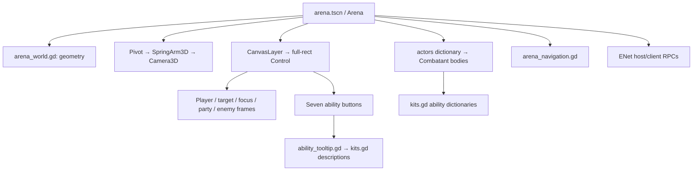

# Ringfall — complete engineering and product handoff

Updated: 2026-09-07. This file is intended to let Claude Code or another developer continue without the preceding conversation. The implementation is a playable prototype, not a finished arena service. Read this file, then inspect the current source before making assumptions; later changes may supersede specific values here.

## 1. What the user is building

The user wants a standalone arena game with **World of Warcraft's gameplay and controls** and **League of Legends' pick-a-champion, enter-a-match structure**. The comparison to League concerns the roster and lack of gearing, not its camera, movement, targeting, map, lanes, or economy.

The intended experience is:

1. Pick an original champion with a complete, fixed specialization-like kit.
2. Enter an arena with equal starting power, without leveling or gearing first.
3. Win through movement, positioning, line of sight, cooldown trading, interrupts, crowd control, healing and team coordination.
4. Eventually support an accessible queue and competitive team matches.

The user explicitly chose third-person camera, WASD movement, mouse turning, strafing and tab targeting. Preserve this direction. The project uses original names and generated placeholder geometry; it contains no WoW assets or copied game client code.

Initially there were two local characters and six abilities. The user then authorized these five development steps: combat feedback, better sparring bots, more distinct champion kits, authoritative multiplayer duels, and 3v3 with healers. Prototype versions of those now exist. Do not describe their existence as production readiness or finished balance.

### Latest explicit requirements — preserve these

- Normal ability hover must show a **simple description of what the ability does**.
- Holding **Shift while hovering** must show detailed mechanics. Pressing or releasing Shift while stationary must update the tooltip without leaving/re-entering the button.
- **Never select targets by clicking a character model**, including the player's own model. No model raycast picking or overhead-nameplate picking should be reintroduced.
- Target selection is through **Tab for enemies, clickable UI frames, or keybinds**. Explicitly choosing yourself through F1 or your frame remains valid.
- The user hit a specific bug: both mouse buttons enabled forward movement, capture recentered the cursor, and the next press selected their own character. The fix removes model picking, protects captured clicks from GUI routing, and restores the pre-capture cursor position.
- The user requested this in-depth Markdown handoff for Claude Code.

The user prefers implementation over repeated planning/confirmation. Keep chat updates concise and make real changes within the requested scope. Explain actual limitations candidly. Do not silently run an always-on service or claim one was deployed because a localhost test passed.

## 2. Workspace and tools

| Item | Current state |
| --- | --- |
| Repository/workspace | `/home/plato/codex` |
| Engine used and tested | Godot `4.5.1.stable.official.f62fdbde1` |
| Executable | `/usr/local/bin/godot` |
| Language | GDScript; Python standard library for network test launchers |
| Main project | `project.godot` |
| Main scene | `arena.tscn` |
| Main scene node | `Arena`, a `Node3D` with `scripts/arena.gd` attached |
| Renderer | OpenGL compatibility (`gl_compatibility`) |
| Reference viewport | 1280 × 800; canvas-items stretch |
| Art/dependencies | Code-generated meshes, default font; no downloaded assets/dependencies |
| Default networking | ENet, UDP 27840 |
| Generated editor data | `.godot/`, ignored by `.gitignore` |
| Screenshots | `artifacts/`, with `.gdignore` so Godot does not import test captures |

Some previous tool commands needed permission to run outside the execution sandbox because Godot writes editor settings/user data outside the workspace, opens windows, or binds localhost UDP. This is a tool-environment issue, not a requirement to modify game code or store user data in the repository. Do not assume the next execution environment has the same restrictions.

The workspace's `.git` was presented as a protected directory by the tool environment. No commit, branch, PR, or remote repository was established as part of this work. Inspect actual Git state before assuming version-control operations are available.

## 3. Launch and server expectations

### Local play

Open `project.godot` in Godot and press **F5**, or:

```sh
cd /home/plato/codex
godot --path .
```

Pick champion and mode, then **Local sparring**. Empty slots are bots. To test healing quickly, choose **Luminary**, **Team arena · 3v3**, then Local sparring.

Shortcuts:

```sh
godot --path . -- --local --team --champion=Luminary
godot --path . -- --local --champion=Vanguard
```

### Multiplayer

There is **no always-on server, service manager, cloud deployment, matchmaking service, or web server** configured in this project. The host player's running game process is the server. The user previously reported that “the server's not up”; a port-inspection request was interrupted, so do not infer a running service from that exchange.

1. Host chooses champion and mode, then clicks **Host lobby**.
2. Friends choose champions, enter the host address, and click **Join**.
3. Host waits for the roster to show the expected players.
4. Host clicks **Start round / Rematch**.
5. The host must remain connected for the session to exist.

For multiple copies on the same machine, join `127.0.0.1`. For LAN machines use the host's LAN address, with UDP 27840 reachable. For internet play, the host must be reachable via routing/UDP forwarding or an appropriate shared VPN; this has not been tested across separate internet connections. No relay traversal is implemented.

```sh
# Host window:
godot --path . -- --host --team --champion=Vanguard

# Separate client window on the same computer:
godot --path . -- --join=127.0.0.1 --champion=Ember
```

`--host` opens a lobby, not an automatically starting dedicated server. A headless `--host` process still reserves a player slot for the host and has no interactive way to click Start. The test scripts start rounds programmatically. Do not recommend plain headless `--host` as a complete unattended deployment.

Modes allow two people for 1v1 or six for 3v3. Bots fill empty slots. Human roles are unrestricted. Team assignment alternates to balance counts, beginning with the host on blue. Champion and mode selectors are disabled while connected; leave/rehost to change them. Rematch reuses the roster. Joining during a round is rejected; there is no reconnect-to-your-old-slot flow.

If a client leaves during a match, its existing fighter becomes a bot. If the host leaves, clients return to the menu. No host migration exists.

## 4. File map and reading order

| File | Responsibility |
| --- | --- |
| `project.godot` | Engine configuration and entry scene |
| `arena.tscn` | Minimal root scene; most content is built at runtime |
| `scripts/arena.gd` | Match lifecycle, local input, camera, GUI, target selection, authoritative combat, bots and networking |
| `scripts/arena_world.gd` | Arena floor, grid, pillars, walls, lighting and material/box helpers; parent script of `arena.gd` |
| `scripts/combatant.gd` | One `CharacterBody3D` fighter's state, generated appearance, overhead status/health, snapshot packing/applying |
| `scripts/kits.gd` | Champion names, fresh ability dictionaries, short and expanded descriptions |
| `scripts/ability_tooltip.gd` | Passive tooltip panel with wrapping text, style, cached content and viewport placement |
| `scripts/arena_navigation.gd` | Inflated-obstacle AStarGrid2D pathfinding |
| `tests/combat_test.gd` | Deterministic combat, navigation and snapshot checks |
| `tests/ui_test.gd` | Real-window mouse/key routing, model-click regression, frame clicks, tooltip content and bounds |
| `tests/network_peer.gd` | Godot host/client driver for two-process network tests |
| `tests/run_network.py` | Starts those two processes, collects results, times out and cleans up |
| `tests/six_peer.gd` | Godot driver for a host plus five clients |
| `tests/run_six.py` | Six-process 3v3 test launcher |
| `tests/visual_check.gd` | Staged lobby/healer screenshots in a real game window |
| `README.md` | Player-facing launch, controls, champions, network instructions and short engineering overview |
| `CLAUDE.md` | This handoff |

Recommended source-reading order: `kits.gd` → `combatant.gd` → `arena.gd` lifecycle and input → combat → network → UI → navigation → relevant tests.

`arena.gd` is still large. A future refactor could extract input/camera, UI, network session, bot decision-making and combat simulation. Do that in reviewable steps with existing tests preserved, not as a prerequisite to every small change. Child indices in unit frames and seven-slot loops are current coupling points.

## 5. Runtime structure and state

The root builds arena geometry, then camera and UI. Fighters are spawned per round. No character scenes, animation trees, resource files or authored navigation mesh are required.



### Match fields

- `actors`: actor ID → combatant node. Actor IDs are round-local and distinct from network peer IDs.
- `local_id`: the actor controlled by this instance. Determined from `owner_peer`, not assumed to equal the peer ID.
- `selected_id`: local UI target; never overwritten from network actor-target snapshots.
- `focus_id`: independent local focus target.
- `phase`: `menu`, `connecting`, `lobby`, `countdown`, `match`, or `results`.
- `mode`: players per team, **1 or 3**, not total players.
- `roster`: peer ID → `{champion, team}` for humans. Bots are not roster entries.
- `network`: whether an ENet session is active. Offline mode uses `OfflineMultiplayerPeer`.
- `epoch`: round/session generation. Old messages must not affect a later round.
- `winner`: winning team index or -1 before results.
- `elapsed`: match time excluding countdown.
- `countdown`: initially 3 seconds.

`begin_round()` clears actors/selection/focus, advances epoch, builds humans first, fills bots, sets countdown, assigns the local actor and announces initial state. `assign_local()` also selects an initial enemy through `cycle_target()`; this is automatic round setup, not model picking.

During countdown actors settle to the floor. During match the authority ticks each fighter, then checks whole-team elimination. In 3v3 one fighter's death does not end the round. A dead local player retains the camera at their corpse and may observe remaining teammates; there is no spectator camera switching yet.

`finish_round()` sets results, cancels casts, restores cursor visibility and shows persistent victory/defeat. Clients apply the reliable final state. Periodic snapshots are ignored after results, avoiding stale packets resurrecting health/casts or reopening a finished round.

Opening the panel does **not** pause simulation. It zeros locally gathered movement. Escape resumes the panel during a round, cancels an existing cast, clears target, or opens the panel according to current state.

### Fighter fields

Each combatant owns HP (100 maximum), seven cooldowns, GCD, cast slot/time/locked cast target, stun/lockout/ward/sprint timers, DR count/reset timer, movement intent, queued jump, input age, selected target for AI/network purposes, bot timers/path, peer/team/champion, and network sequence bookkeeping.

`owner_peer == 0` means bot; a nonzero value identifies a human connection. Dead fighters are not removed during a round; their capsule model flattens and darkens, and frames show zero HP. Their collision mask permits actors to overlap, so they do not body-block teammates or enemies.

## 6. Controls, mouse capture and target routing

| Input | Behavior |
| --- | --- |
| W/S | Forward/backward |
| A/D | Turn, or strafe with RMB |
| Q/E | Strafe regardless of mouse mode |
| Space | Queue jump, executed only when grounded and not stunned |
| LMB held in world | Orbit camera without turning the fighter |
| RMB held in world | Rotate camera and desired fighter facing |
| Both mouse buttons | Forward run |
| Mouse wheel | Zoom between 3 and 18 meters |
| Tab | Cycle living enemies in actor iteration order |
| F1/F2/F3 | Self / first teammate / second teammate |
| Party or enemy button | Select that displayed fighter |
| Player/target/focus unit frame | Select the fighter currently represented by that frame |
| F | Store selected actor as focus |
| G | Select stored focus, if still in actor dictionary |
| 1–7 / ability click | Send ability request |
| Hover / Shift-hover | Short / expanded explanation |

Movement intent is normalized. Forward/strafe speed is 6.5 units/s; any positive backward component currently uses 3.8 units/s. Keyboard turn rate is 2.5 rad/s. Jump impulse is 7; gravity is 20. Sprint multiplies movement speed by 1.65. There is no acceleration, slope tuning, auto-run toggle or rebinding UI.

The camera pivot follows the local character at +1.6m. Default spring length is 10m and pitch -0.38 rad. Mouse sensitivity is 0.004 radians/pixel; pitch clamps to [-1.15, 0.12]. SpringArm collision mask is world-only (1), so players do not push the camera inward.

### Specific bug fix and why it matters

Previously `_unhandled_input()` projected an LMB ray from the camera, intersected character colliders, and assigned `selected_id`. Mouse capture puts the cursor at screen center, frequently over your own character. Repeated both-button movement therefore selected self.

Current code has **no targeting raycast** in mouse input. World LMB/RMB initiate camera capture only. Combat line-of-sight raycasts remain; those are unrelated and must not be removed.

- `capture_mouse()` records the first free-cursor position and enters captured mode.
- `release_mouse()` exits capture, warps back to the recorded viewport position, and clears the saved state.
- Releasing one button while the other remains held does not release capture.
- Focus loss calls `release_mouse(false)` to avoid warping the pointer into an unfocused window.
- `_input()` consumes additional captured LMB/RMB presses before the GUI sees them, preventing a recentered click from hitting a frame behind the capture point.
- `_unhandled_input()` handles uncaptured world clicks after GUI processing.
- `on_unit_frame_input()` handles only left-button presses on uncaptured unit frames, using the `actor_id` metadata updated by `update_frame()`.
- Party/enemy buttons call `select_party()`/`select_enemy()` and use their current actor lists.
- Children of unit frames have `MOUSE_FILTER_IGNORE`; the frame has `MOUSE_FILTER_STOP`, so clicking the health label/bar still reaches its frame and does not begin camera capture.

Do not add hidden click-to-select behavior to models, nameplates, damage labels or the ground. Explicit frame/key targeting is now a product requirement, not a temporary workaround to revisit without the user.

## 7. Ability descriptions and tooltip UI

`Kits.summary(ability)` supplies one short effect sentence. `Kits.description(ability, champion, expanded)` supplies title + summary + Shift hint, or the complete description. Powers, range, cast time and ability cooldown are read directly from the same dictionary the simulation uses.

Expanded text covers:

- Effect amount/duration and actual targeting behavior.
- Cast time, own cooldown, range, resource cost (currently none) and GCD behavior.
- Self-only vs friendly-target fallback vs hostile-target validation.
- Movement/cast cancellation and fixed cast target.
- When own cooldown starts versus GCD.
- Kind-specific mechanics: interrupts missing, DR/immunity, dispel limits, nonstacking protection, mobility obstruction, healing cap/dampening.
- Availability while moving, casting, dead, stunned or spell-locked.

Important: a few shared mechanics are hard-coded in simulation and explanatory text, including 60% mitigation, 1.5s GCD, 65% sprint boost, charge stopping/damage radii and dampening formula. If changing them, update both. A later improvement is to centralize shared balance constants rather than create a second independent tooltip rules engine.

`ability_tooltip.gd` is a passive PanelContainer:

- Its own controls all ignore mouse input, so it cannot intercept clicks or create a hover loop.
- It is drawn above other controls (`z_index = 100`).
- Normal content width is 320, expanded width 470, capped against viewport width.
- Label text wraps, with 15px type and 12px margins.
- `present()` caches width/content to avoid reconstructing text layout every frame, resets minimum size when content changes, and positions above the hotbar pointer while clamping to screen bounds.
- `update_ability_tooltip()` polls hotbar rectangles and `Input.is_key_pressed(KEY_SHIFT)` each visual tick. This is why stationary Shift toggling works.
- Native `Button.tooltip_text` is not also populated; there should be no competing delayed default tooltip.
- Hide tooltips while a menu is open, mouse capture is active, no local fighter exists, or no ability is hovered.

The UI tests check every expanded ability at the 1280×800 reference viewport. Very small arbitrary aspect ratios/scales are not comprehensively tested. If more prose is added, recheck bounds and consider scrollable/readable layouts rather than clipping or shrinking to unreadable type.

## 8. Champion data and exact current numbers

Seven zero-indexed slots correspond to keys 1–7. Dictionaries have fields `name`, `kind`, `power`, `range`, `cast`, `cd`, `off`. `get_kit()` returns new dictionaries; do not accidentally share mutable cooldown state between fighters.

| Champion | Key | Ability / kind | Power | Range | Cast | Own CD | Off GCD |
| --- | --- | --- | --- | --- | --- | --- | --- |
| Ember | 1 | Firebolt / damage | 16 damage | 28 | 1.5s | 0 | No |
| Ember | 2 | Flare / damage | 22 damage | 22 | Instant | 7s | No |
| Ember | 3 | Disrupt / interrupt | 4s lock | 22 | Instant | 12s | Yes |
| Ember | 4 | Stasis / control | 4s stun | 20 | 0.8s | 16s | No |
| Ember | 5 | Ward / shield | 5s duration | Self | Instant | 22s | Yes |
| Ember | 6 | Mend / self_heal | 28 healing | Self | 2s | 16s | No |
| Ember | 7 | Blink / blink | 8m travel | Self | Instant | 14s | Yes |
| Vanguard | 1 | Cleave / damage | 13 damage | 3.5 | Instant | 0 | No |
| Vanguard | 2 | Crush / damage | 25 damage | 3.5 | Instant | 7s | No |
| Vanguard | 3 | Pummel / interrupt | 4s lock | 4 | Instant | 12s | Yes |
| Vanguard | 4 | Bash / control | 3s stun | 3.5 | Instant | 16s | No |
| Vanguard | 5 | Iron Skin / shield | 5s duration | Self | Instant | 22s | Yes |
| Vanguard | 6 | Mend / self_heal | 28 healing | Self | 2s | 16s | No |
| Vanguard | 7 | Charge / charge | 6 damage | 22 | Instant | 12s | Yes |
| Luminary | 1 | Smite / damage | 10 damage | 28 | 1.5s | 0 | No |
| Luminary | 2 | Renewal / heal | 18 healing | 28 | Instant | 7s | No |
| Luminary | 3 | Dispel / dispel | Remove stun | 28 | Instant | 10s | Yes |
| Luminary | 4 | Rebuke / control | 3s stun | 20 | 1s | 18s | No |
| Luminary | 5 | Sanctuary / ally_shield | 5s duration | 28 | Instant | 22s | Yes |
| Luminary | 6 | Greater Heal / heal | 27 healing | 28 | 1.8s | 0 | No |
| Luminary | 7 | Grace / sprint | 4s duration | Self | Instant | 16s | Yes |

Power is interpreted by kind. It is not always damage. There are no projectiles with travel time, crits, armor, AoE, damage-over-time, healing-over-time, resources, mana, energy, rage or gear modifiers. “Cleave” is currently single-target despite its name.

## 9. Authoritative combat pipeline

1. Local hotkey/button calls `send_action(slot)`.
2. Offline/host calls `try_spell(local_id, slot, selected_id)`. A client sends an RPC to the host.
3. Host validates ownership through sender ID, phase/epoch/sequence/rate, slot bounds, HP/stun/casting, cooldown/GCD and spell lockout.
4. `spell_target()` resolves helpful/self targeting.
5. `validate_spell()` checks living target, faction, distance, world-only line of sight and offensive facing.
6. A cast-time spell stores `casting`, `cast_left`, `cast_target`; an instant spell resolves immediately.
7. GCD starts when accepted (including cast start) unless `off`.
8. `tick_actor()` moves the character, cancels casts on movement/airborne state, decrements cast time, and revalidates stored target on completion.
9. `resolve_spell()` starts own cooldown and applies the effect. `combat_event()` broadcasts visible feedback.
10. Authority checks team victory after ticking all actors.

A changed UI selection does not redirect an already-started cast. Invalid spells do not start GCD/cooldown. An otherwise valid but ineffective interrupt/dispel/immune stun still spends its cooldown. Cancelled cast-time abilities keep the GCD already triggered but do not start their own cooldown.

### Target rules

Self-only kinds always choose caster and do not change UI selection. `heal`, `ally_shield`, `dispel` choose a selected ally; enemy/no selection falls back to self. A selected dead ally remains invalid, not fallback-self. Offensive kinds require a selected enemy.

Offensive facing uses a nonnegative dot product between local forward (-Z) and target direction: effectively a forward half-space, not a narrow cone. Distance uses 3D positions. Line of sight casts from each actor position + Vector3.UP using world layer 1. Characters do not block each other's spells.

Helpful spells on other actors require range/sight but not facing. Self spells skip range/sight. Only living actors can be valid spell targets.

### Control and defenses

- Stuns cancel casting, prevent movement/actions, and share one DR category across all champions.
- Duration factors are 1, 0.5, 0.25, 0.0. A successful stun increments count and sets reset timer to `18 + duration`; immune attempts do not extend it.
- Dispel clears stun and limits remaining reset timer to 18 seconds, without resetting count.
- Damage does not break stun.
- Interrupt cancels an active cast and sets `locked = 4`. Missing does neither but spends CD.
- Vanguard ignores spell lockout completely, including for its Mend. This is current behavior, not a fully designed school system.
- Ember can use Ward/Blink while locked. Luminary can use Grace while locked, but Sanctuary is `ally_shield` and is currently blocked. Keep descriptions accurate if changing this.
- No spell can be used while already casting, even off-GCD defensive abilities. No stun-breaker exists. Dispel cannot be self-cast while stunned.
- Ward multiplies incoming damage by 0.4 for five seconds. It does not absorb a pool or prevent CC. Refreshing a shield replaces its timer, not stacking mitigation.
- Blink/Charge call `move_and_collide()` to sweep actual geometry. Charge aims to stop 1.8m short and deals damage only if final distance ≤3.5m. There is no charge minimum range or stun.

### Healing and victory

Health is capped at 100 and damage at remaining health. Healing uses:

```text
reduction = clamp((elapsed - 60) / 180, 0, 0.7)
actual_heal = min(missing_health, base_heal * (1 - reduction))
```

This reaches 70% at **186 seconds (3:06)**, not four minutes. An older README said four minutes; that documentation was corrected while implementing detailed tooltips. The combat formula was not changed.

No resurrection or respawn during a round. Victory requires eliminating the whole opposing team. If both teams are empty in the same check, the current expression favors blue; there is no explicit draw rule.

## 10. Bots, navigation and arena geometry

The arena floor is 36×36, with boundary walls at ±18. Four pillars are centered at x=±6, z=±5. Pillar shafts are 2.8×5×2.8; bases/caps extend to 3.3m. The floor grid and spawn stripes are decorative, not solid. Physics geometry uses world layer 1.

Fighter capsules have radius 0.42 and height 1.8, centered 0.9m above their origin. Fighters use collision layer 2 and mask 1, so they collide with the world but not each other. Keep camera/LOS mask 1 independent of any targeting changes.

`arena_navigation.gd` builds a 35×35 one-meter AStar grid over integer coordinates [-17,17]. Cells within two units in X and Z of pillar centers are solid, providing body clearance. Diagonals are permitted only without corner obstacles. `nearest()` searches nearby free cells if an actor's rounded cell is solid; `route()` returns world-XZ waypoints.

If geometry changes, update grid obstacles too. There is no automatic navmesh bake. A navigation test actually moves a bot from one side of a pillar to regain sight on the other side, so merely returning a plausible path is not the only validation.

Current bot behavior:

- Sort living enemies by distance and living allies by HP.
- Luminary prioritizes an injured ally below 76 HP; others generally pursue nearest enemy.
- Turn toward intended destination, choose melee range 2.8 or ranged desired distance 20.
- Replan paths every 0.45s; consume waypoints within 0.55m.
- Try ability decisions every 0.25s.
- Ward below 45 HP; healer dispels controlled allies and heals damaged allies.
- Damage champions try interrupts when enemy cast remaining time is below 1s.
- Vanguard charges from beyond 7m; Ember tries to blink away from enemies closer than 5m.
- Damage champions may self-heal below 55 HP when sight is broken.
- Otherwise attempt control, burst, and primary damage.

All bot casts go through the same `try_spell()` validation as players. Bots do not bypass range, cooldowns or stun rules. They still have limitations: no strategic teammate positioning, no coordinated burst plans, no robust focus switching, no intelligent DR tracking, and no advanced path smoothing. Retreat intent may be overridden by an ability-decision tick; kiting is rudimentary. Do not sell these as competitive opponents.

## 11. Networking implementation in detail

### Authority and transport

`authoritative()` is true offline or on the host. Only authority advances combat, physics movement, bot decisions and match results. Clients render server state and collect input; they do not send their desired HP or position.

ENet is created by `host_session()` or `join_session()`. The host accepts up to five remote peers. `SceneMultiplayer.server_relay` is disabled before assigning ENet: clients talk to the host, not to each other. This also removed engine relay errors when multiple clients left simultaneously. Do not casually enable peer relay without testing that case again.

The node path and RPC declarations must match between builds. Test drivers instantiate `arena.tscn` under `/root/Arena`, matching the regular game. Adding RPCs only on one side or moving the root can break Godot's RPC checksum/path matching.

### Core RPCs

| Method | Direction/permission | Delivery | Purpose |
| --- | --- | --- | --- |
| `register_player` | Client → host, any_peer | Reliable | Validate champion and register human in available lobby |
| `rejected` | Host → client, authority | Reliable | Explain unavailable/full lobby |
| `lobby_state` | Host → clients | Reliable | Roster, mode and status |
| `round_started` | Host → clients | Reliable | Epoch, mode and complete actor setup |
| `submit_input` | Client → host, any_peer | Unreliable ordered, channel 1 | Epoch, sequence, normalized intent, desired yaw, jump and target |
| `submit_action` | Client → host, any_peer | Reliable, channel 1 | Epoch, sequence, ability slot and requested target; -1 means cancel cast |
| `receive_snapshot` | Host → clients | Unreliable ordered, channel 2 | Compressed fighter state, phase and clocks |
| `ping_host` / `pong` | Client ↔ host | Unreliable, channel 3 | Displayed transport RTT |
| `private_notice` | Host → owning client | Reliable | Rejection/cast feedback |
| `show_event` | Host → clients | Reliable | Damage/heal/interrupt/status visuals |
| `finish_round` | Host → clients | Reliable | Final snapshot and winning team |

Remote input/action handlers obtain `multiplayer.get_remote_sender_id()` and resolve that peer's actor. They do not trust a client-supplied actor ID. Non-finite movement/yaw are rejected; movement is capped to unit length. Desired yaw is wrapped to [-PI,PI]. Remote action attempts have a 0.05s budget. Abilities also enforce their own cooldowns/GCD. No general-purpose packet flood defense or authentication exists.

Host-owned input is applied every physics tick. Remote input is sent at 30Hz, snapshots at 20Hz. Input older than 0.3s zeros intent, preventing endless movement if a client stops sending. Jump is currently a one-packet boolean on the unreliable input stream, so packet loss could miss a jump. That case has not been hardened or tested.

### Snapshots

`Combatant.snapshot()` produces primitive dictionaries containing identity, peer, team, champion, position/yaw, HP, seven cooldowns, GCD, cast slot/time, stun/lock/ward/sprint, DR state and selected actor target.

Periodic states are `var_to_bytes()`-encoded and compressed with **DEFLATE**. `receive_snapshot()` uses matching dynamic decompression capped at 65536 bytes and decodes primitive Variants. Object decoding is not enabled. Initialization/results remain reliable structured data.

DEFLATE matters: an earlier attempt used FASTLZ with `decompress_dynamic()`, which Godot does not support. That was fixed and network tests rerun. Do not pair FASTLZ with dynamic decompression. Uncompressed six-fighter dictionaries exceeded ENet's MTU and generated fragmentation/loss warnings; compression removed the observed warnings. Packet sizes still deserve monitoring if snapshot content expands.

Clients ignore mismatched epoch, older/equal sequence, and all periodic snapshots after results. `round_started()` resets their last snapshot sequence. Delayed helper sends recheck network role and epoch after waiting, preventing sends from leaking into a different session.

Client bodies interpolate to `net_position` and `net_yaw` with a delta×22 factor capped at 1. There is **no movement prediction, replay/reconciliation, historical hit rewind or lag compensation**. Camera rotation responds locally, but actor movement responds to the server and will feel delayed over high-latency links. This is a material next engineering task, not proof the current control scheme is wrong.

### Delay testing and disconnects

`--latency-ms=N` (0–500) delays outgoing client movement/action submissions and outgoing host snapshots by N ms. Passing 75 on each side adds about 150ms to the movement-feedback path. It does not delay every reliable event or ping, emulate jitter/loss, or reproduce real WAN conditions. The displayed RTT does not include this injected application delay.

On client departure, roster entry is erased and its fighter's `owner_peer` becomes 0. Movement/casting reset and the bot takes over. In-round disconnect notification is deferred rather than broadcasting synchronously inside peer-disconnection processing. In results it is unnecessary. Host departure closes the session instead of migrating authority.

Rejected joins receive an explanation and return to menu. Connection failure and a roughly 10s connection timeout also return to menu. There is no server browser, lobby discovery, ready voting, matchmaking, persistent rating, reconnect reservation or administration UI.

## 12. Rendering and UI caveats

Arena and champions are deliberately simple generated primitives. A small forward marker indicates facing. Overhead labels use billboard text; health meshes face the camera while avoiding a collinear look-at warning. Damaged/healed actors flash white briefly. Floating event labels rise/fade for ~1.1s; beam effects persist ~0.16s. These are feedback cues, not projectile simulation.

Model colors and overhead health use absolute team colors. Main health frames use blue for an ally of the local player and red for an enemy, even when the local player belongs to red. Do not confuse presentation color with team indices.

Unit frames are VBoxContainers whose children are currently assumed to be:

0. Title Label.
1. Health ProgressBar, containing a centered amount Label.
2. Cast ProgressBar, containing a centered cast Label.
3. Status Label.

Changing this structure requires updating `update_frame()` and tests. The frame's actor ID metadata is refreshed each visual tick for click selection. Party/enemy rows are Buttons with live HP/status text, not separate scene instances.

Anchored controls must use `offset_left/top/right/bottom`. An earlier build used absolute `.position` after setting center/bottom anchors and placed the panel/hotbar off-screen. Real viewport screenshot checks caught it. Preserve the corrected anchor offsets when editing menus, hotbar, tooltips or enemy frame placement.

Tooltip text sizing also needs a real render check: autowrapped Label text at an uninitialized width can temporarily calculate a very tall minimum size. The tooltip sets the Label's width before assigning new text and resetting its panel size. Tests wait for container layout before final screenshot/bounds assertions.

## 13. Validation and how to run it

### Current recorded evidence

- Combat integration suite: **47/47 passed** during this change.
- Mouse/tooltip UI suite: **64/64 passed**; includes all 21 champion-slot descriptions and their bounds.
- Prior implementation's real two-process duel tests passed, including movement, damage, cast state, snapshots, rematch and disconnect takeover.
- Prior implementation's delayed two-process 3v3 test passed with 75ms injected each direction and no final network warnings.
- Prior implementation's full host + five-client session passed: balanced 3v3 roster, all five clients' movement and shared team result.
- These network suites were not automatically rerun for a tooltip/model-click change; no RPC, snapshot or combat protocol changes were made in this change.
- Lobby, team UI and tooltip screenshots were inspected through actual OpenGL rendering. Assertions alone do not establish usable visual layout.
- No external WAN, NAT traversal, packet-loss, export-package, sound or animation testing was performed.

Run commands from the project root:

```sh
# Import/parse check:
godot --headless --path . --editor --quit

# Combat, healer, mobility, navigation, team win and snapshot checks:
godot --headless --path . --script tests/combat_test.gd

# Actual window required; synthesizes mouse/key input and captures tooltips:
godot --path . --script tests/ui_test.gd

# Lobby and healer scene screenshots:
godot --path . --script tests/visual_check.gd

# Real two-process ENet duel:
python3 tests/run_network.py

# Delayed duel or 3v3:
python3 tests/run_network.py --test-latency
python3 tests/run_network.py --test-team --test-latency

# One host + five clients:
python3 tests/run_six.py
```

Network test suites must run **sequentially**, not concurrently, because they share UDP 27840. Stop any interactive host you intentionally started before running them, rather than silently killing unknown user processes. Python launchers enforce timeouts and clean up their child processes. They return failure on nonzero exits or Godot `ERROR:` output; some success-marker text can appear even when assertions fail, so inspect exit code and complete result.

### Combat test coverage

Valid target/facing/LOS, missing target, movement cancellation, cast completion, GCD, off-GCD interrupt, spell lockout, own cooldown, DR progression/reset, ward mitigation, capped healing, Blink collision sweep, Charge range/damage, six-actor bot filling, one healer per local team, friendly heal/dispel, friendly-fire rejection, self fallback, heal LOS, individual vs team death, victory/defeat/rematch, real bot navigation, oversized/non-finite input rejection, invalid slot, HP UI, compressed snapshot decoding/ordering and terminal-state protection.

### UI test coverage and headless trap

The UI test feeds events through Godot's input system, using viewport-to-window coordinate transforms and cursor warping. It tests:

- Click self/enemy models without retargeting, including from no selection.
- Repeated both-mouse-button capture cycles preserve target.
- Player, party, enemy and focus frame clicks.
- Tab and F1 key targeting.
- Simple hover and stationary Shift expand/collapse.
- Hiding tooltip during panel/capture.
- Short tooltip compactness and every expanded description fitting the reference viewport.

It requires a real game window and will explicitly reject `--headless`. Headless display drivers do not provide faithful mouse capture/position, and the reference viewport can differ from the dummy display size. Earlier failing headless mouse tests were a test-environment problem, not evidence that the real input changes failed.

Artifacts are staged validation captures, not untouched gameplay recordings. The scripts may freeze simulation, position actors, lower an ally's HP and start a heal to make specific UI states visible.

### Manual acceptance test for the latest change

1. Launch local 3v3 and Tab to an enemy.
2. Click your own model and enemy models. Target must stay unchanged.
3. Hold both buttons to run, release, then repeat several times. Target must not become self, cursor must return to its starting location, and movement/camera must still work.
4. Click your own health frame, teammate rows, enemy rows and a stored focus frame. Each should select exactly the represented actor.
5. F1 selects self; F2/F3 select teammates; Tab cycles living enemies.
6. Hover each hotbar ability: short explanation. Hold Shift while keeping pointer still: full explanation. Release Shift: short explanation again.
7. Move off the button or start mouse-look: tooltip disappears. Tooltip must not steal button/frame clicks.
8. Check low/high edges of hotbar and the longest cast/heal descriptions for clipping.
9. Repeat one sequence as a joined client when doing broader network playtesting; local targeting should still affect only that client's selection.

## 14. Known limitations and useful next work

These are observations or future options, not authorization to implement everything automatically.

### Highest-value next work

1. **Human control feel testing.** Tune camera distance/pitch, movement/turn speed, jump, keybinds and hotbar ergonomics with the user. Preserve the explicit no-model-targeting rule.
2. **Client movement prediction/reconciliation.** Current server interpolation adds noticeable delay. Keep server validation; do not make HP or combat client-authoritative to hide lag.
3. **Extract large subsystems.** Separate session transport, combat, input/camera, GUI and bot decisions from the large `arena.gd` without changing behavior in the same step.
4. **Data-driven shared balance constants.** Values duplicated in combat and detailed descriptions should have one source. Add resources or custom ability effects only when their gameplay purpose is clear.
5. **Better team feedback.** Resource bars if resources are designed, clearer focus/selected frame treatment, status icons, target-of-target, combat log, death/spectator UI.
6. **Better bots.** Coordinate interrupts, avoid wasted DR, kite without their own action loop overriding retreat, switch pressure targets, and choose useful healer positions.
7. **Dedicated service/lobby path.** If requested, build a true unattended server startup/ready flow and document deployment. Current `--host` is not that.
8. **Assets/animation/audio.** Replace primitive models and beam cues incrementally after core feel is accepted. There are no existing asset pipelines to preserve.

### Specific code edges to know about

- Seven ability slots and several UI child indices are hard-coded.
- No resources, spell queue window, configurable keybindings or configurable tooltip delay.
- All current stun types share one DR bucket.
- All Vanguard abilities ignore spell lockout; Luminary Sanctuary is blocked while locked. This is coarse champion/kind logic.
- Off-GCD actions cannot be used while casting. A self-dispel cannot be used while stunned. Tooltips intentionally explain these limitations.
- `cycle_target()` uses dictionary order, not nearest/screen-space ordering; with no living candidates it may retain an old selected ID.
- Frame selection can inspect a dead actor, but spell validation rejects dead targets. No resurrection exists.
- Client movement is interpolated, not predicted; snapshot timing can make cast timers/HP update in small steps.
- Jump is carried unreliably; network fault simulation does not test loss/jitter.
- There is no authentication, reconnect reservation, user identity/profile, anti-cheat product, host migration or malicious-packet fuzz suite.
- The snapshot decoder validates outer Array type and trusts the authoritative host's shape; it is not a general hostile-host protocol parser.
- Timed visual nodes may briefly outlive a round reset. They are not gameplay state.
- Most bots try abilities at a fixed 0.25s cadence. Behavior and balance are not competitive-quality.
- Small window sizes and unusual display scales need additional UI testing.
- No exported binaries or packaging configuration were produced; launch through Godot/source.

## 15. Practical troubleshooting

| Symptom | First checks |
| --- | --- |
| “Server isn't up” / Join fails | Is a game instance actually hosting? Correct IP? Host reachable on UDP 27840? Joining own machine uses 127.0.0.1; remote machine does not. There is no pre-deployed service. |
| Host starts but nothing fights | Host lobby needs Start; countdown lasts 3s. Plain headless host cannot click Start. |
| Could not bind port | Another host/test may already own UDP 27840. Identify it before changing ports or stopping processes. |
| Cast won't start | Correct phase, living target/team, range, sight, facing, movement/ground, GCD/CD, active cast, stun/lockout. |
| Healing self instead of teammate | Enemy/no selection falls back to self. Select teammate via F2/F3 or frame. |
| Dispel does not remove lockout | It only removes stun. This is current design. |
| Blink stops early | Capsule sweep hit pillar/wall; intentional. |
| Clicking a model does nothing | Intentional latest user requirement. Use Tab/frames/keybinds. |
| Tooltip fails only in headless tests | Run real-window UI test; cursor APIs aren't faithfully emulated headless. |
| Tooltip blank/tall initially | Check Label width is set before text and minimum-size reset; allow container layout, inspect actual rendering. |
| Hotbar/panel off-screen | Check anchor offsets, not absolute `.position` after center/bottom anchor presets. |
| FASTLZ decompression errors | Periodic snapshots must use matching DEFLATE with dynamic decompression. |
| ENet oversized unreliable packet warning | Measure compressed payload size and changed snapshot fields. Do not remove compression casually. |
| Errors when many peers quit | Preserve `server_relay = false` and deferred in-match disconnect announcements. |
| RPC checksum/path errors | Both sides need same scripts, RPC declarations and `/root/Arena` root path. |
| Game reads old code | Stop/relaunch the running project after edits; editor import may be needed for new script files. |

## 16. How to continue responsibly

Start by reading the user's newest request, this handoff, `README.md`, and the functions relevant to that task. Do not restart the game from scratch or replace WoW-style movement with a top-down design. Treat “do this” as authorization to implement the scoped change, not merely propose a plan.

For a UI/input change, run the real-window UI suite and inspect captures. For combat changes, run combat tests and update the descriptions to remain truthful. For network/lifecycle changes, run the two-process and six-process suites sequentially, including a delayed run when timing is relevant. Avoid rerunning expensive unrelated suites without a change/failure that warrants it.

Keep the README usable for a player. Put architecture, limitations and future refactor notes here rather than in the game's menus. Do not describe a direct-connect lobby as matchmaking, a headless test as a deployed server, or an assertion suite as proof of enjoyable balance.

Relevant upstream references used in implementation:

- [Godot 4.5 Viewport input routing and coordinate conversion](https://docs.godotengine.org/en/4.5/classes/class_viewport.html)
- [Godot input coordinates and captured mouse behavior](https://docs.godotengine.org/en/stable/tutorials/inputs/mouse_and_input_coordinates.html)
- [Godot high-level multiplayer](https://docs.godotengine.org/en/4.4/tutorials/networking/high_level_multiplayer.html)
- [Godot AStarGrid2D](https://docs.godotengine.org/en/4.4/classes/class_astargrid2d.html)
- [Godot byte-array compression](https://docs.godotengine.org/en/4.4/classes/class_packedbytearray.html)

Treat source and reproduced test results as authority when older notes and code differ.

## Final verification for this handoff

On 2026-09-07, the combat suite passed **47/47** and the real-window UI suite passed **64/64**. Short and expanded tooltip screenshots were inspected and showed readable content in correctly sized panels. All 21 expanded champion-slot descriptions fit the reference viewport. Model clicks, repeated both-button capture, frame selection, Tab/F1 targeting and stationary Shift toggling were exercised through input events.

Latest change scope: `scripts/arena.gd` (target input, clickable frames, enemy frame list, cursor restoration, tooltip integration), `scripts/kits.gd` (descriptions), new `scripts/ability_tooltip.gd`, new `tests/ui_test.gd`, README updates and this handoff. Combat numbers and networking protocol were preserved. Network results recorded above belong to the prior implementation validation, not a newly deployed or continuously running server.
