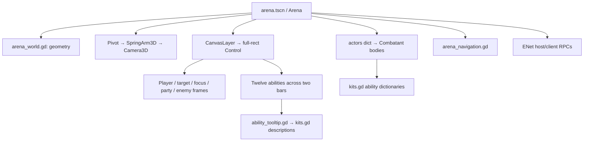

# Technical Architecture

## Animation timing across network updates — September 10 audit

Character animation still evaluates locally on the physics/visual tick, independently of the 20Hz snapshots. The complete live roster uses `model_forge_art.gd` or `fulcrum_art.gd`; Outlaw and Vanguard add specialized layers. Assets, animation clips, accepted offline cadence and server gameplay timing are unchanged.

- `snapshot_animation_clock.gd` advances cosmetic elapsed time between received samples, gently correcting fresh reports without rewinding within an action. Outlaw Roll and Backflip use independent instances; `outlaw_backflip_clock.gd` remains a compatibility entry point. Authoritative/offline actors retain their exact existing gameplay timer. Landing, cancellation, death and replacement reset the relevant visual clock. Completion never grants a hit, proc, immunity or combo permission.
- `network_animation_motion.gd` prevents lerp/reconciliation position changes from masquerading as gait speed. Remote gait uses the existing snapshot velocity; predicted local gait uses current local physics velocity. Offline animation keeps measured displacement. The local receipt counter and cached presentation velocity are not added to snapshots. Stops and real direction/speed changes remain responsive.
- The jump-arm overlay previously sampled the remote vertical velocity only at packet arrival. It now evaluates the same accepted ballistic pose curve with a cosmetic velocity estimate between reports, using the existing 20m/s² gravity. Projection stops after 250ms without a fresh report; fresh landing/revision state resets it. This moves bones only, never the collision body or jump trajectory.
- `outlaw_effects.gd` evaluates Coin Toss's existing ballistic path with a separate client visual clock. A terrain ray clamps the displayed segment to prevent visual travel through walls. The authoritative `coin_position` still decides ricochets and never changes during painting. Expiry, consumption, death, actor removal, class replacement and subsequent tosses reset/clear presentation state. Offline coin placement is unchanged.

Audit findings: steady 6.5m/s remote movement previously measured as 3.845–9.585m/s and alternated Run/Sprint in all five classes. Remote Roll, jump-arm overlays and Coin Toss repeated poses/positions between packets. The regression now shows a steady 6.5m/s gait and zero held steps in those sampled sequences. Regular cast/idle playback, Vanguard strikes/recoil/shield pulses, death/recovery, Outlaw gun/knife timers, local tweens and Gravity Anchor's idle effect already run on local time. Gun/knife pose tables retain their existing 30Hz source sampling; that is separate from packet-rate stepping. HUD values, authoritative animation-state arrival, and whole-body remote position interpolation remain separate concerns; this change does not add buffered movement interpolation or make all future animation code automatically network-safe.

Coverage: `tests/network_animation_audit_test.gd` covers all five classes, remote and corrected-local gait, jump overlays, regular cast/aim base playback, Roll, coin travel, wall clamps, stops, resets, packet-outage bounds and preservation of gameplay state. The existing `tests/run_backflip_network.py` accepts `--roll` or `--coin` and optional `--remote` to check the acting client or an observer over delayed real ENet. Existing class/pose/equipment/hitbox and Backflip tests remain relevant. Three older pose tests explicitly end their remote fixture before resuming direct offline pose probes; original expected pose/cadence values remain intact. Logs and scoped pre-change files are under `artifacts/network-animation-audit/`. Human online visual review remains necessary; no release was published by this audit.

## Outlaw gameplay and presentation

`outlaw_mechanics.gd` owns combo windows, airborne immunity predicates, swept Roll travel, coin trajectories, per-caster Severe bleeds and the two mobile channels. Identity fields replicate with the existing snapshots. Roll travel state rewinds before client input replay; damage, combo stacks and instant-Severe grants remain authoritative. Deadeye acquires all eligible enemies without initial visibility filtering and checks final LOS/range. Defense Detonation checks each of its three shots separately; kick immunity applies only to that channel. `crowd_control.gd` and forced-movement entry points reject control during airborne Backflip. Matched client/server schemas are required for the added effect RPC.

`outlaw_art.gd` extends the shared v2 presenter and `outlaw_equipment.gd` preserves the native fist grip around hand-parented weapons. Ability overlays affect the relevant arm; moving channels keep locomotion legs. Actual library Roll is reused for directional rolls and reversed for Backflip, with brief entry easing. The 32 inherited source clips and 53 core rest bones remain unchanged. `outlaw_effects.gd` reuses a prebuilt 24-shot mesh pool and persistent coin/Deadeye markers, while Outlaw damage bypasses the older generic per-hit beam allocation. Class-specific icon aliases permit distinct Outlaw Ward/Mend art without replacing other classes' art. Details and tuning are in `OUTLAW_CLASS.md`.

## Offline arena detail levels

`tools/arena_mesh_lods.gd` uses ImporterMesh offline to generate index-only LODs with zero normal-merge angle. It copies generated LOD indices into the original ArrayMesh serialized surfaces to avoid requantizing base normals/UV2. This depends on Godot 4.5 storage; SHA256 and save/reload guards verify the unchanged packed base mesh. No runtime simplification or position-only shadow mesh is used. `sanctum_slice.gd` selects detail with bias 0.5 for authored architecture only.

`tools/generate_arena_lods.gd` writes a dry-run trial under ignored artifacts; `-- --apply` saves it to runtime mesh paths plus `lod_manifest.json`. After any architecture regeneration/light bake, rerun this tool to refresh LODs and provenance. `prepare_sanctum_slice.gd` also generates LODs during initial import. Inspect the trial using `tools/arena_lod_review.gd -- --trial`, then run `tests/arena_lod_test.gd` (CI) after applying. The test validates manifest coverage, packed geometry/UV hashes, lightmap sizes, reduced complete triangles and valid vertex indices. Benchmark results and limits live in `FORWARD_PLUS_ASSESSMENT.md`.

## Eliminated players and spectating

`spectator_presentation.gd` owns local-only UI and target selection. `show_event` records the local player’s hostile incoming events after epoch validation; DEFEATED freezes the last three entries within eight seconds. No new RPC or snapshot fields. `sync_hud_visibility` refreshes the card and hides personal controls; `_process` follows the selected living teammate’s interpolated position with the existing spring-arm camera. Target-next/previous bindings switch spectators only while eliminated. Survivor loss picks another teammate, no survivors await the authoritative result, and `clear_actors` resets history and follow state. World duels retain their existing behavior. `tests/spectator_test.gd` covers state transitions, buttons, keys, follow position, recap freeze and layout bounds.

## Champion introduction

`champion_introduction.gd` is placed beside the portrait in a shared HBox for Online/Offline. It supplies concise role/resource guidance and selects three real kit abilities per champion. Icons use AbilityArt; hover descriptions reuse Kits.description to avoid duplicating balance values. Entering a signature row immediately shows a dedicated ability_tooltip instance with its icon, gold heading and wrapped description. Native tooltip_text stays empty, and there is no click popup. Exit, champion changes and hidden menus dismiss the card; placement follows the pointer within UI bounds. All Abilities switches the menu into an abilities state, expands the same hover rows to the complete live kit in a ScrollContainer, and retains the portrait/picker. Back and Escape restore the originating submenu. There is no practice action. The guide hides in connection submenus and outside selection; the portrait remains above the picker. The fast `champion_introduction_test.gd` suite checks every guide against kit data, details, selection, and practice roster.

## Champion selection preview

`champion_choice` is visible only in the Online/Offline selection branches (online, offline, queue, host, join), not launch/settings/results. `menu_presentation.gd` inserts `champion_preview.gd` immediately before it and refreshes on `item_selected`. The preview is a TextureRect fed by its own-world SubViewport with an orthographic camera and two unshadowed lights. Only the current imported GLB instance is retained; its AnimationPlayer is manual and posed once at Idle. UPDATE_ONCE redraws on selection, visibility, size changes and horizontal mouse dragging; hidden previews stop rendering. The centered 3:4 portrait grows to 360 UI units high, shrinking to fit short menus. Left-button dragging rotates the model around its vertical axis. The cached texture uses 2× physical-pixel supersampling, capped proportionally at 1536 pixels, with 4× MSAA and linear filtering; gameplay render scale does not reduce portrait resolution. Root-disabled 3D/headless tests skip rendering. Match authority and selected-character handling are unchanged.

## Menu presentation

`menu_presentation.gd` installs static 2D presentation around the existing arena controls: play cards, contextual headings, status surface and result metric cards. `refresh_menu()` calls its refresh; layout follows control minimum sizes and viewport resize. Existing result summary text remains populated for consumers, with the cards replacing its visual display. Settings actions are moved below the fields. `ability_tooltip.present_availability()` separates restriction text from the description, resetting size only when content/state changes; aura tooltips clear the restriction row. Cooldown overlays keep their countdown/keybind hierarchy and add inset restriction outlines and a 15px status strip. Gameplay validation, RPCs, render presets and audio are unchanged.

`tools/menu_layout_review.gd` checks ten menu states at 1280×720, 1280×800 and 1920×1080 using the UI fixture. `tools/polish_review.gd` captures the actual Forward+ scene, including restrictions, defeat and pause.

## Client polish and rendering budgets — 0.11.0

The UI interaction suite uses `tests/ui_test_arena.gd`, a test-only subclass that builds production collision without environment art. Its viewport disables 3D drawing while preserving the real window, full-resolution CanvasLayer controls, input, camera projection and actors. This prevents full-arena software rendering from dominating UI assertions. The separate map/ability-art/Vanguard suites still render real assets. UI progress is printed every 25 checks; CI bounds that step to three minutes.

- `UserConfig` persists graphics preset, frame limit, 3D scale, and FPS visibility. `frame_budget()` limits focused matches/countdowns to the selected 60–240 FPS (default 60), other phases to 30, and unfocused clients to 15. `arena._physics_process` applies the render budget without changing simulation frequency. Dedicated runtime retains its existing 60 Hz policy. `project.godot` also supplies a 60 FPS startup ceiling.
- `SanctumGraphics.apply_profile` exposes Balanced (default), High, and Performance. Balanced keeps SSAO, bloom/palette and 2× MSAA; removes SSIL, volumetric fog, and shrine omni shadows. Performance additionally drops SSAO/MSAA and uses FXAA. High retains the former presentation. Models, geometry, collision and authored textures are unchanged. `--sanctum-high`, `--sanctum-base`, and `--sanctum-original` remain explicit review overrides.
- `ability_block_reason` is a read-only shared gate for authoritative `try_spell` and advisory UI. It retains spell-target fallback, resource/anchor prerequisites, LOS, range, facing, casting, lockout, root and movement rules. Availability is cached per kit index at 10 Hz for hotbar badges; hover gets the current exact reason. Buttons continue submitting to the server. Cooldown/CC sweeps remain separate. `CooldownOverlay` adds text/color badges, including abbreviated text for small slots.
- Menu controls are state-specific; a separate overview camera never replaces the player's saved gameplay zoom. `finish_round(epoch, winner, states, info={})` adds server-provided duration, automatic-rematch flag, delay, and minimum players. Clients show a local visual countdown and wait for the server to actually start. Roster broadcasts update current results population without changing active fighters to lobby mid-round; the eventual server lobby broadcast opens the waiting screen. Auto-rematch callbacks are epoch-guarded. Protocol/version bumped together to 0.11.0.
- `tests/polish_test.gd` covers UI state, real cast restrictions, rematch activation and frame-budget policy. `tests/run_polish.py` / `polish_peer.gd` exercise countdown, automatic rematch, disconnect and waiting with a dedicated host and two real ENet clients. `tools/polish_review.gd` verifies Forward+ presets and writes four `artifacts/polish-*.png` captures; it is not a performance benchmark. Native review captured 1920×1080 despite a requested 1280×800 because of compositor/display behavior.


_Reference for developers and AI agents making code changes. If a value here diverges from the code, **the code is authoritative** — update this file to match._

Design values (GCD, DR factors, healing formula, controls speeds) live in [`GAME_DESIGN.md`](GAME_DESIGN.md). This file covers implementation.

## Workspace and tools

| Item | Value |
| --- | --- |
| Repository | `/home/plato/codex` |
| Engine | Godot `4.5.1.stable.official.f62fdbde1` |
| Executable | `/usr/local/bin/godot` |
| Language | GDScript; Python stdlib for network test launchers |
| Main project | `project.godot` |
| Main scene | `arena.tscn` |
| Root node | `Arena` (`Node3D`) with `scripts/arena.gd` attached |
| Renderer | Forward+ High default; Compatibility available (`docs/FORWARD_PLUS_ASSESSMENT.md`) |
| Reference viewport | 1280 × 800 base; canvas-items stretch, **expand** aspect |
| Window | Launches borderless fullscreen (`window/size/mode=3`) at the monitor's resolution |
| Networking | ENet. Queues on UDP 27840 (duel) / 27841 (3v3); private lobby pool on 27850–27853. Ports live in `scripts/config.gd`. |
| Screenshots | `artifacts/` (with `.gdignore` so Godot skips them) |

## File map

Recommended reading order for a new developer: `kits.gd` → `combatant.gd` → `arena.gd` lifecycle and input → combat → network → UI → navigation → relevant tests.

| File | Responsibility |
| --- | --- |
| `project.godot` | Engine configuration, entry scene |
| `arena.tscn` | Minimal root scene; most content built at runtime |
| `scripts/arena.gd` | Match lifecycle, local input, camera, GUI, target selection, authoritative combat, bots, networking, dedicated mode. **~1,300 lines — flagged for extraction in [`ROADMAP.md`](ROADMAP.md).** |
| `scripts/arena_world.gd` | Floor, grid, pillars, walls, lighting. Parent of `arena.gd`. |
| `scripts/sanctum_corner.gd` | Arena-wide reversible material overrides, opposing wall shrines, warm lights and one reflection probe. No collision. |
| `scripts/sanctum_graphics.gd` | Default High environment profile, gated on the actual Forward+ renderer after fallback; `--sanctum-base` opts out. |
| `scenes/sanctum_corner_preview.tscn` | Interactive corner/lighting A/B viewer with four cameras, orbit and zoom. |
| `tools/sanctum_corner_review.gd`, `tools/renderer_probe.gd` | Real-rendered art checks and native-GPU static/active-combat measurements. Headless is rejected for renderer validation. |
| `scripts/combatant.gd` | `CharacterBody3D` fighter — state, generated appearance, snapshot pack/apply. |
| `scripts/champion_model.gd` | Dispatches all four champions to their imported Blender models and preserves procedural art for unknown entries. Collision stays on the parent fighter. |
| `scripts/vanguard_authored.gd` | Imported 45-bone crystal hammer warrior, eight clips, animated cape, per-actor textured PBR and impact flash, confirmed-hit Strike and shield/recoil; see `VANGUARD_REFERENCE_REBUILD.md`. |
| `scripts/ember_art.gd` | Imports the skinned Ember GLB; current movement responsiveness uses measured speed and immediate locomotion/idle transitions, with 0.12-second entry to Cast. Updates presentation only. |
| `scripts/luminary_art.gd` | Luminary skinned GLB and seven authored clips; retains the original 0.20-second transition and smoothed-speed logic, with staff/cape controls and head-weighted hood baked into the asset. |
| `scripts/fulcrum_art.gd` | Fulcrum skinned GLB and seven inherited movement/cast clips, plus six mantle controls and four gravity-weapon controls baked into the asset. Matches current Ember measured-speed responsiveness: immediate locomotion/idle transitions, 0.12-second entry to Cast, smoothed cadence. Mask, hood, armor, relics and the orbiting weapon are visual geometry, with no gameplay or VFX changes. |
| `scripts/ability_art.gd` | Cached name-to-texture presentation mapping covering all twelve-slot kits; hotbar art layer and engine-rendered frames. |
| `tools/art_review.gd` | Renders front/back character lineup and full icon atlas to `artifacts/` in a game window. |
| `scripts/kits.gd` | Champion names, ability dictionaries, short + expanded descriptions. |
| `scripts/ability_tooltip.gd` | Passive tooltip panel — wrapping text, cached content, viewport placement. |
| `scripts/arena_navigation.gd` | Inflated-obstacle AStarGrid2D pathfinding. |
| `scripts/config.gd` | Deploy-time constants — `SERVER_ADDRESS`, `SERVER_PORT`, `VERSION`, defaults. Deploy pipeline rewrites this per release. |
| `scripts/key_bindings.gd` | Rebindable primary/secondary keys for movement, targeting, duels and every action-bar slot; conflict-swap, reserved-key guard, save/load. |
| `scripts/keybind_menu.gd` | Modal panel reached from Settings → Keybinds. Search, per-row clear, reset-all, capture-then-press key rebinding. |
| `scripts/movement_prediction.gd` | Client-side movement prediction and reconciliation against snapshots. Movement-only; combat stays server-authoritative. |
| `tests/combat_test.gd` | Deterministic combat, navigation, snapshot checks. |
| `tests/movement_bindings_test.gd` | Prediction, reconciliation, and full keybind menu (search, conflict swap, reserved keys, round-trip save). |
| `tools/keybind_review.gd` | Renders `artifacts/keybind-menu.png` / `keybind-bars.png` for the keybind UI. |
| `tests/ui_test.gd` | Real-window mouse/key routing, frame clicks, tooltip content and bounds. |
| `tests/network_peer.gd` + `network_fixture_arena.gd` + `run_network.py` | Two-process ENet duel/team replication fixture. |
| `tests/six_peer.gd` + `run_six.py` | Host + 5 clients (3v3). |
| `tests/dedicated_client.gd` + `run_dedicated.py` | Dedicated server + 2 clients (version handshake, auto-start). |
| `tests/visual_check.gd` | Staged lobby/healer screenshots. |

## Runtime structure



### Match state fields

- `actors` — actor ID → `Combatant` node. Round-local IDs, distinct from network peer IDs.
- `local_id` — actor controlled by this instance. Derived from `owner_peer`. **Not assumed** equal to peer ID. `-1` in dedicated mode.
- `selected_id`, `focus_id` — local UI target and focus. **Never** overwritten from network snapshots.
- `phase` — `menu` | `connecting` | `lobby` | `countdown` | `match` | `results`.
- `mode` — players **per team** (1 or 3). Not total players.
- `roster` — peer ID → `{champion, team}` for humans. Bots are not roster entries. Host is not a roster entry in dedicated mode.
- `network` — whether an ENet session is active. Offline uses `OfflineMultiplayerPeer`.
- `epoch` — round/session generation. Old messages must not affect a later round.
- `winner` — winning team index, or `-1` before results.
- `elapsed` — match time excluding countdown.
- `countdown` — starts at 3 s.
- `dedicated`, `min_players`, `rematch_delay` — dedicated-server config.
- `menu_state` — `main` | `online` | `offline`. Only meaningful when `phase == "menu"`.

### Fighter fields (per `Combatant`)

HP (max 100), twelve cooldowns, GCD, cast slot / time / target, stun / lockout / ward / sprint timers, DR count / reset, movement intent, queued jump, input age, selected target, bot timers / path, peer / team / champion, network sequence bookkeeping.

`owner_peer == 0` → bot. Nonzero → human connection.

Dead fighters stay in the world (not removed) — capsule flattens and darkens, frames show 0 HP. Collision mask permits actor overlap; dead fighters do not body-block.

### Lifecycle

- `begin_round()` — clear actors, advance epoch, spawn humans from roster first, fill remaining slots with bots, set countdown, assign local, announce initial state via `round_started` RPC.
- `assign_local()` — finds the actor whose `owner_peer` matches this instance's peer ID; runs `cycle_target()` for an initial enemy. Automatic setup, not model picking.
- Countdown: actors settle to floor. Match: authority ticks each fighter, then checks whole-team elimination.
- 3v3 does not end on a single death — teammates continue.
- `finish_round()` — sets results, cancels casts, restores cursor, shows persistent victory / defeat. Clients apply the reliable final state. Periodic snapshots ignored after results.
- Opening the panel does **not** pause simulation — just zeroes local movement input.

## Combat pipeline

1. Local hotkey / button → `send_action(slot)`.
2. Offline or host → `try_spell(local_id, slot, selected_id)`. Client → RPC to host.
3. Host validates: sender ID → phase / epoch / sequence / rate → slot bounds → HP / stun / casting → cooldown / GCD → spell lockout.
4. `spell_target()` resolves helpful / self targeting.
5. `validate_spell()` checks living target, faction, distance, world-only line of sight, offensive facing.
6. Cast-time spell → stores `casting`, `cast_left`, `cast_target`. Instant → resolves immediately.
7. GCD starts when accepted (including cast start), unless `off`.
8. `tick_actor()` moves character, cancels casts on movement / airborne, decrements cast time, revalidates stored target on completion.
9. `resolve_spell()` starts own cooldown and applies the effect. `combat_event()` broadcasts visible feedback.
10. Authority checks team victory after ticking all actors.

**Rules:**

- Changed UI selection does not redirect an already-started cast.
- Invalid spells do not start GCD or cooldown.
- Otherwise-valid-but-ineffective interrupt / dispel / immune stun still spends its cooldown.
- Cancelled cast-time abilities keep the GCD already triggered but do not start their own cooldown.

Design values (GCD duration, DR factors, healing formula, etc.) live in [`GAME_DESIGN.md`](GAME_DESIGN.md).

## Networking

### Authority and transport

`authoritative()` is `true` offline or on the host. Only authority advances combat, physics, bot decisions, and results. Clients render server state and collect input.

ENet is created by `host_session()` (server) or `connect_to(port)` (client). `SceneMultiplayer.server_relay` is **disabled** — clients talk only to the host. Do not casually re-enable; see [`DECISIONS.md`](DECISIONS.md).

`current_port` is a variable, not a constant: the client sets it per connection, and a dedicated server takes it from `--port=` (falling back to the mode's queue port, or the first lobby port under `--lobby`).

### Client entry points

| Menu action | Function | Behavior |
| --- | --- | --- |
| Online queue | `matchmake()` | Connects to `Config.DUEL_PORT` or `TEAM_PORT` from the selected mode. Sets `searching`, so the lobby panel reads "Searching for…" with an `n of m players ready` count. |
| Host lobby | `host_lobby()` → `begin_probe("host", …)` | Walks `Config.LOBBY_PORTS` in order, sending `claim_lobby(mode, version)`. |
| Join lobby | `join_lobby(code)` → `begin_probe("join", …)` | Decodes the slot from the code's first character and dials that one server. Falls back to walking the pool if the prefix names no live slot. |

**Lobby codes encode their slot.** The first character is the index into `Config.LOBBY_PORTS` of the server that issued the code; the remaining characters are random. Pool members mint codes with no coordination, so without this two slots could issue the same string — and a joiner, which stops at the first match, would silently send players to the wrong lobby. Encoding the slot makes that collision impossible rather than merely unlikely, and lets a join skip the probe entirely. `Config.LOBBY_PORTS` must never grow past `CODE_ALPHABET`.

`intent` (`""` / `"queue"` / `"host"` / `"join"`) selects what `on_connected()` sends. The probe advances on three signals: an explicit `lobby_busy` reply, `connection_failed`, or the 10-second connect timeout. Exhausting the pool reports "All lobbies are in use" or "No lobby found with code X" and drops back to the menu.

`close_peer()` tears down the ENet peer **without** resetting menu state — that is the difference between it and `leave_session()`, and it is why probing can hop ports without bouncing the player to the main menu.

### Private lobbies

A lobby process runs `--dedicated --lobby --port=N` and idles with `private_lobby = true`, `claimed = false`. `claim_lobby` accepts only when unclaimed with an empty roster, then sets `mode`, `min_players = mode * 2`, generates a code, and replies `lobby_found(code, mode)`. `resolve_lobby` replies `lobby_found` only for an exact code match on a claimed, non-full lobby; every other case replies `lobby_busy` so the client keeps walking. The slot releases in `on_peer_left()` when the roster empties, logging `LOBBY RELEASED`.

`max_peers` for a private lobby is 6 regardless of mode — the mode is not known until a client claims it.

**Players never see an address or port.** `broadcast_lobby()` sends `""` in place of `status` to dedicated clients, because the server's status line names its port. The client composes its own lobby text from `roster`, `remote_min_players`, `searching` and `lobby_code`.

`max_peers`:

- Player-hosted (`--host`): 5 (host takes one slot).
- Dedicated (`--dedicated`): `mode * 2` (host takes no slot).

**Node path and RPC declarations must match between builds.** Test drivers instantiate `arena.tscn` under `/root/Arena`, matching regular play. Adding an RPC on only one side, or moving the root, breaks Godot's checksum matching.

### Core RPCs

| Method | Direction / permission | Delivery | Purpose |
| --- | --- | --- | --- |
| `register_player(choice, client_version)` | Client → host, any_peer | Reliable | Validate champion **and** `VERSION`; hard-reject mismatched versions |
| `rejected(reason)` | Host → client, authority | Reliable | Explain unavailable/full lobby or version mismatch |
| `lobby_state(players, size_per_team, message)` | Host → clients | Reliable | Roster, mode, status |
| `round_started(epoch, mode, states)` | Host → clients | Reliable | Complete initial actor setup |
| `submit_input(...)` | Client → host, any_peer | Unreliable ordered, ch 1 | Sequenced movement, yaw, jump event/age, target, walk, motion revision, buffer preference |
| `submit_action(...)` | Client → host, any_peer | Reliable, ch 1 | Ability slot plus action-time movement/facing sequence; `-1` cancels cast |
| `receive_snapshot(...)` | Host → clients | Unreliable ordered, ch 2 | DEFLATE-compressed fighter state |
| `ping_host` / `pong` | Client ↔ host | Unreliable, ch 3 | Displayed transport RTT |
| `private_notice(...)` | Host → owning client | Reliable | Rejection / cast feedback |
| `show_event(...)` | Host → clients | Reliable | Damage / heal / interrupt visuals |
| `finish_round(epoch, winner, states)` | Host → clients | Reliable | Final snapshot and winning team |

### Input and snapshots

- Host-owned input applied every physics tick.
- Remote input every physics tick; snapshots at 20 Hz. `Input.use_accumulated_input = false` so a keydown is visible the same tick it arrived.
- Input older than 0.3 s zeros intent — prevents endless movement if a client stops sending.
- Jump presses carry monotonically increasing event IDs, retransmitted for up to 350 ms until a snapshot acknowledges them. The server deduplicates events, acknowledges rejected requests, bounds reported age, and checks phase, life, CC and motion revision. Retransmission carries the original revision, so a teleport cannot revive an old request. Round/reconnect rebuilds reset event state. This bounds client retry time; it does not claim delivery during sustained outages or perfectly synchronized packet age across machines.
- An optional 100 ms landing buffer is shared by server simulation and prediction; it is distinct from network retries. Snapshots include jump acknowledgment, buffer remaining, and walk state. Running physics and takeoff momentum are unchanged; walking is a bounded 0.5 speed multiplier.
- Actions carry movement/facing intent and its sequence, never a position or velocity. The local input sample precedes spell validation. A late reliable action validates against its own legal facing/intent while restoring newer movement afterward; existing spell/CC/range/LOS validation stays authoritative. Invalid numeric input is rejected before advancing movement sequences.
- `movement_controls.gd` owns world mouse gestures. UI clicks cannot initiate steering or two-button movement. Camera rotation uses `screen_relative`; focus/menu/edit cancellation clears gestures and suppresses held movement until release. Optional camera follow changes only camera yaw. Keybindings retain their integer representation with a separate mouse-device flag for middle and side buttons.
- Snapshots: `var_to_bytes()` + `FileAccess.COMPRESSION_DEFLATE`, decoded with matching dynamic decompression capped at 65536 bytes. **Do not switch to FASTLZ** — see [`DECISIONS.md`](DECISIONS.md).
- Clients ignore mismatched epoch, older-or-equal sequence, and periodic snapshots after results.
- Remote actors (everyone except the local player) interpolate `net_position` / `net_yaw` with `delta * 22` capped at 1.
- **Local movement is client-predicted.** `scripts/movement_prediction.gd` runs `apply_input` + `simulate_movement` on the local actor the same tick the key is pressed, then buffers the command. Each snapshot carries `move_ack` (last simulated input seq), `velocity`, and `motion_revision` (bumped by teleport / knockback / swap). Reconcile snaps to server state, replays unacknowledged history, and skips the correction when sub-frame error is under 0.12 m and no collision separates old and new positions. `motion_revision` mismatch forces a hard resync so ability displacements are never overwritten. Prediction is scoped to movement only — HP, cooldowns, casts, CC and abilities remain server-authoritative; combat still resolves on the host.

### Client validation (server-side)

Remote input / action handlers obtain `multiplayer.get_remote_sender_id()` and resolve that peer's actor. They **do not trust** a client-supplied actor ID. Non-finite movement / yaw are rejected. Movement is capped to unit length. Desired yaw is wrapped to `[-π, π]`. Remote action attempts have a 0.05 s budget. Abilities still enforce their own cooldowns / GCD. **No packet flood defense or authentication exists.**

### Dedicated mode specifics

- `--dedicated` in `parse_arguments()` triggers `host_session(true)`.
- Host is not in `roster`; no actor has `owner_peer == 1`; `local_id` stays `-1`. Guards throughout the code already handle `not actors.has(local_id)`.
- After each `register_player` accept, `maybe_auto_start()` fires. When `roster.size() >= min_players` and `phase == "lobby"`, `begin_round()` runs.
- `finish_round()` on authority in dedicated mode schedules `get_tree().create_timer(rematch_delay).timeout.connect(_dedicated_rematch)`. The callback checks `phase == "results"` and roster size to decide whether to rematch or hold in lobby.
- Startup logs `DEDICATED READY <version> port=<n> mode=<n> min_players=<n> rematch_delay=<s> private=<bool>`. Round transitions log `DEDICATED ROUND START|END|REMATCH|WAITING`; private lobbies also log `LOBBY CLAIMED code=<c> port=<n> mode=<n>` and `LOBBY RELEASED port=<n>`. These lines are what `tests/run_dedicated.py` and `tests/run_lobby.py` grep for.

### Delay testing and disconnects

- `--latency-ms=N` (0–500) delays outgoing client input and outgoing host snapshots by N ms. Not jitter, not loss. Displayed RTT excludes injected delay.
- Client leaves during a match → its fighter's `owner_peer` becomes 0 (bot takes over). The entire `peer_disconnected` handler uses `CONNECT_DEFERRED`, so roster/result/world RPCs run after ENet polling removes departing transport peers. The in-round notice is also deferred. This prevents sends to zero-channel connections during simultaneous departures. Godot 4.5.1 emits the server signal before erasing its peer entry ([engine source](https://github.com/godotengine/godot/blob/4.5.1-stable/modules/enet/enet_multiplayer_peer.cpp#L206-L207)).
- Host leaves → clients return to menu. No host migration.
- Rejected joins get an explanation and return to menu. Connection failure and ~10 s timeout also return to menu.

## Bots and navigation

Arena floor is 36 × 36 with boundary walls at ±18. Four pillars centered at x = ±6, z = ±5. Pillar shafts 2.8 × 5 × 2.8; bases / caps extend to 3.3 m. Physics geometry uses collision layer 1. Fighter capsules use layer 2, mask 1 (collide with world, not each other). Keep camera / LOS mask 1 independent of any targeting changes.

`arena_navigation.gd` builds a 35 × 35 one-meter AStar grid over integer coordinates `[-17, 17]`. Cells within two units in X and Z of pillar centers are solid, providing body clearance. Diagonals allowed only without corner obstacles. `nearest()` searches nearby free cells if an actor's rounded cell is solid; `route()` returns world-XZ waypoints.

**If arena geometry changes, update the grid too.** No automatic navmesh bake.

### Current bot behavior

- Sort enemies by distance, allies by HP.
- Luminary prioritizes an injured ally < 76 HP; others pursue nearest enemy.
- Vanguard melee range 2.8; others ranged desired distance 20.
- Replan paths every 0.45 s; consume waypoints within 0.55 m.
- Ability decisions every 0.25 s (fixed cadence).
- Ward below 45 HP; healer dispels controlled allies and heals damaged allies.
- Damage champs try interrupts when enemy cast remaining < 1 s.
- Vanguard charges from beyond 7 m; Ember tries to blink away from enemies closer than 5 m.
- Damage champs may self-heal below 55 HP with sight broken.

All bot casts go through `try_spell()` — same validation as players. Bots do not bypass range, cooldowns, or stun. Limitations recorded in [`ROADMAP.md`](ROADMAP.md).

## Rendering and UI

Feedback cues:

- Damaged / healed actors flash white briefly.
- Floating event labels rise / fade for ~1.1 s.
- Beam effects persist ~0.16 s.
- Overhead labels use billboard text; health meshes face the camera while avoiding a collinear look-at warning.

**Unit frame children are indexed** (see `update_frame()`):

0. Title Label
1. Health ProgressBar (with centered amount Label)
2. Cast ProgressBar (with centered cast Label)
3. Status Label

Changing this structure requires updating `update_frame()` and tests. Frame's `actor_id` metadata is refreshed each visual tick for click selection. Party / enemy rows are Buttons with live HP / status text, not separate scene instances.

**Anchor gotcha:** anchored controls must use `offset_left/top/right/bottom`. An earlier build used absolute `.position` after center/bottom anchor presets and placed the panel / hotbar off-screen. Real viewport screenshot checks caught it. Preserve corrected anchor offsets when editing menus / hotbar / tooltips / enemy frames.

**Tooltip initialization:** autowrapped Label text at an uninitialized width can temporarily calculate a very tall minimum size. The tooltip sets Label width before assigning new text and resetting its panel size. Tests wait for container layout before final screenshot/bounds assertions.

**Menu states** (`menu_state` variable, only meaningful when `phase == "menu"`):

- `"main"` — Online / Offline buttons.
- `"offline"` — Local sparring + Back.
- `"online"` — Host + address + Join + Back.

Rows are `HBoxContainer`s toggled by `refresh_menu()`. Mode picker is visible in submenus, hidden in main. Champion picker is always visible in the menu.

## HUD cooldowns

`scripts/cooldown_overlay.gd` is a `Control` parented to each hotbar button, drawing a radial sweep with `draw_colored_polygon` over a fan of points. Radius is half the slot's diagonal so the wedge reaches the corners rather than leaving lit crescents.

**It runs its own clock.** `update_visuals()` only refreshes when server state arrives, well below frame rate, so an overlay that waited to be told would tick in visible steps. `sync()` supplies the authoritative remaining/duration whenever a snapshot lands and `_process` fills the gaps.

`GCD_DURATION` in `arena.gd` is shared by the simulation and the sweep — the first of the duplicated balance constants noted in [`ROADMAP.md`](ROADMAP.md) to be pulled out of an inline literal.

Slot text is the ability name; the keybind is drawn in the overlay's corner so the countdown owns the centre. Once real icons exist the overlay needs no change — only what sits under it.

## Display

The game launches borderless fullscreen and adopts whatever resolution the monitor reports — nothing detects it explicitly, the mode does that. **F11 and Alt+Enter** toggle back to a window, because a game that starts fullscreen has to offer a way out.

The 1280 × 800 base is 16:10 and the stretch aspect is `expand`: on a 16:9 monitor the viewport becomes wider (1422 × 800 at 1080p) so the extra width shows more arena, rather than letterboxing (`keep`) or distorting (`ignore`).

**The windowed suites pin their own window** to 1280 × 800 in `run()`. Without that, mouse coordinates and screenshot framing would depend on the monitor running the tests. Verified by running them against 1280 × 800, 1440 × 900 and 1600 × 1000 screens with identical results.

## Testing

All tests run from project root. Network suites bind fixed ports — **run sequentially**.

**Run `godot --headless --path . --import` first on any fresh clone.** Test
scripts launched with `--script` do not import assets themselves; without the
cache they fail to open every `.ctex` and the harnesses fail on the resulting
`ERROR:` lines even though every assertion passes. This only started mattering
when the project gained its first real assets — the ability icons.

```sh
# Build the import cache (fresh clone, or after changing an asset):
godot --headless --path . --import

# Import / parse check:
godot --headless --path . --editor --quit

# Combat (offline, headless-safe):
godot --headless --path . --script tests/combat_test.gd

# Real window required — mouse capture / cursor position don't work headless:
godot --path . --script tests/ui_test.gd

# Networked, sequential:
python3 tests/run_network.py
python3 tests/run_network.py --test-latency
python3 tests/run_network.py --test-team
python3 tests/run_network.py --test-team --test-latency
python3 tests/run_six.py
python3 tests/run_dedicated.py
python3 tests/run_lobby.py

# Lobby / healer screenshots:
godot --path . --script tests/visual_check.gd
```

`tests/check_suite.sh "<label>" <godot args...>` wraps a Godot suite for CI: it enforces the suite's exit code, requires the `N passed / M total` line to appear at all, and compares N against M. It deliberately does **not** compare against a literal count — a hardcoded number turns every new assertion into a CI failure, which is exactly what happened when the UI suite grew from 64 checks to 73 and the workflow was still grepping for 64.

Python launchers enforce timeouts and clean up child processes. They return failure on nonzero exits or Godot `ERROR:` output. `run_network.py` also requires both success markers; `network_peer.gd` prints PASS only when its assertions pass.

The two-peer team replication fixture keeps all six actors but holds autonomous
bot decisions during the scripted first round, preventing valid interrupts/heals
from invalidating its expected player actions. It restores bot decisions for the
rematch/disconnect check. The client retries Stoke until its cooldown is observed;
the host waits at least seven seconds and for attack evidence before rematching,
with a hard twelve-second assertion deadline. Damage, Heat, casting, extended
cooldown, movement, snapshot ordering and reset assertions remain mandatory.
This tests replication rather than winning an uncontrolled bot fight; production
bot behavior is unchanged. A separate six-peer suite exercises a full human roster.

The `ERROR:` check is stricter than it looks: Godot prints RID-leak errors at exit for any `Control` that was constructed but never added to the scene tree, so an orphaned node fails the suite even when every assertion passed. If a network suite starts failing with `RID allocations ... were leaked at exit` and no assertion message, look for a `.new()` UI node missing its `add_child`.

### What each test verifies

- `combat_test.gd` — valid target/facing/LOS, movement cancellation, cast completion, GCD, off-GCD interrupt, spell lockout, own cooldown, DR progression/reset, ward mitigation, capped healing, Blink collision sweep, Charge range/damage, six-actor bot filling, one healer per local team, friendly heal/dispel, friendly-fire rejection, self fallback, heal LOS, individual vs team death, victory/defeat/rematch, real bot navigation, invalid input rejection, HP UI, compressed snapshot decoding, terminal-state protection.
- `run_network.py` — movement, damage, cast state, snapshots, rematch, disconnect takeover.
- `--test-team` — same but 3v3, both peers control humans, remaining slots are bots.
- `--test-latency` — 75 ms each direction (~150 ms total). Verifies no protocol warnings under delay.
- `run_six.py` — host + 5 clients, full 3v3 human roster. Balanced teams, all peers moving, shared team result.
- `run_dedicated.py` — one `--dedicated` server + 2 clients driven through `matchmake()`. Verifies version handshake, the queue's port-per-mode choice, and auto-start via server output.
- `run_lobby.py` — two `--lobby` servers + 3 clients. The first host claims 27850 and holds it; the second must probe past it to 27851. Verifies `lobby_busy` probe advance, that each code decodes to the slot that issued it, and that a code-joined duel starts. Both clients print `LOBBY CODE=<code> port=<n>` so a failure says which server answered.

### UI test coverage

- Click self / enemy models without retargeting.
- Repeated both-mouse-button capture cycles preserve target and restore cursor position.
- Player / party / enemy / focus frame clicks.
- Tab and F1 key targeting.
- Hover and stationary Shift expand/collapse.
- Tooltip hidden during panel / capture; doesn't steal button / frame clicks.
- All 21 expanded champion-slot descriptions fit the 1280 × 800 reference viewport.

The UI test **rejects `--headless`** — cursor APIs are not faithfully emulated by the dummy display driver.

## Troubleshooting

| Symptom | First checks |
| --- | --- |
| "Server isn't up" / queue hangs | Is the instance for that mode running (`systemctl status 'starfall@*'`)? Is its UDP port reachable? Locally, use `--join=127.0.0.1` or drive `matchmake()` as the tests do. |
| "No lobby found with code X" | The code is right but every pool port was walked without a match. Either the holding instance is down, or `Config.LOBBY_PORTS` and the services in `docker-compose.yml` have drifted out of step. |
| "All lobbies are in use" | Every slot in `Config.LOBBY_PORTS` is claimed. Slots release when their last player disconnects; a crashed client holds one until ENet times out. |
| Host starts but nothing fights | Non-dedicated host must click Start (3 s countdown follows). Plain headless `--host` has no way to click Start; use `--dedicated`. |
| "Could not bind port" | Another instance owns that port. With six server processes, check which: `ss -ulnp | grep 278`. Identify before killing. |
| Cast won't start | Phase, living target/team, range, sight, facing, movement/ground, GCD/CD, existing cast, stun/lockout. |
| Healing self instead of teammate | Helpful spells with no ally selected fall back to self. Use F2/F3 or party frame. |
| Dispel doesn't remove lockout | Dispel only removes stun. Design decision. |
| Blink stops early | Capsule sweep hit geometry — intentional. |
| Clicking a model does nothing | Intentional. Use Tab / frames / keybinds. See [`DECISIONS.md`](DECISIONS.md). |
| Tooltip fails only in headless | Cursor APIs aren't emulated headless. Run real-window UI test. |
| Tooltip blank / tall initially | Label width must be set before text, then reset panel min size. |
| Hotbar / panel off-screen | Check anchor offsets, not absolute `.position` after preset. |
| FASTLZ decompression errors | Snapshots use DEFLATE with dynamic decompression. Don't mix. See [`DECISIONS.md`](DECISIONS.md). |
| ENet oversized unreliable packet | Compressed payload exceeds MTU. Don't remove compression. |
| Errors when many peers quit | Preserve `server_relay = false`, the deferred `peer_disconnected` connection, and deferred in-match disconnect announcements. |
| RPC checksum / path errors | Both sides need same scripts, RPC declarations, `/root/Arena` root path. |
| Version mismatch on join | Client and server disagree on `Config.VERSION`. Rebuild both from the same commit. |
| Game reads old code | Stop and relaunch after edits. New script files may need editor import. |

## Class mechanics (0.6.0)

`class_mechanics.gd` owns class-specific validation, resolution, timed effects, damage interception, bot priorities, and state-driven field visuals. It is called by the authoritative arena pipeline. `Combatant.identity` holds bounded resources, per-caster brands/stars, anchor state, ground fields and defensive timers; snapshots deep-copy it and include cast targets for telegraphs. `auras.gd` derives status icons from these values. `tests/class_identity_test.gd` validates mechanics, terrain/duel restrictions, icons, second-bar access and snapshot round-trips. `tools/class_reference.gd` regenerates the current ability reference.


### World social UI and presentation timing (0.8.0)

`session_social.gd` builds the session chat and world-only challenge/accept/decline controls. Arena RPCs own validated chat relay, duel-state replication, and reliable epoch-checked world despawning. Chat uses channel 4, literal text, 240-character messages, a 750ms per-peer interval, and 100 client-side lines. The opening key uses the shared keybind system. Input polling and hotkeys are blocked while the entry has focus.

`chat_message(epoch, line, speaker_id, bubble_text)` carries the server-resolved actor ID and sanitized message separately from the formatted history line. Clients must use the matching server build (the authentication schema fingerprint detects this RPC signature change). `session_social.gd` manages one transient `chat_bubble.gd` Control per speaker, projects its overhead anchor, and checks scenery occlusion and distance. Dedicated servers allocate no bubbles. Literal Label text, wrapping, message replacement, fades, epoch/actor cleanup and sender attribution are covered by `social_test.gd` and the real ENet `run_social.py`; `chat_bubble_visual.gd` captures the in-game presentation.

World actor IDs increase throughout the world epoch, and actors use individual combat sides. Departures delete their actor, offers, pairing, respawn entry and dangling selections. Arena matches retain bot takeover. Late joins add missing actors instead of rebuilding everyone; existing prediction and camera state survive. Version 0.8.0 requires matching client/server builds because the RPC surface changed.

Physics interpolation is enabled for combatants and the target ring. The camera pivot opts out and follows the actor's interpolated global position each rendered frame; mouse rotation stays immediate. Simulation and prediction remain on physics ticks. Spawn, forced movement, swap and respawn reset interpolation to prevent streaks. This follows [Godot's camera interpolation guidance](https://docs.godotengine.org/en/4.5/tutorials/physics/interpolation/advanced_physics_interpolation.html). Frame-animated scenery opts out via the arena root.

Regression coverage: `social_test.gd`, `run_social.py` (two actual ENet clients: invitation, acceptance, chat, late join without rebuild, disconnect despawn), `camera_interpolation_test.gd` (render updates between deliberately slow physics ticks), and the CC drag/save checks in `ui_test.gd`. Existing movement/latency, combat and class tests remain relevant.


### Fulcrum Meditation and DoTs (historical 0.9.0 baseline)

The historical proc rules below are superseded by [the September 9 combat update](CHARGE_AND_FULCRUM_COMBAT_UPDATE.md): four-second instant buffs, displacement-based cast cancellation, retired Horizon, and continuous routed Vanguard Charge with a replicated travel state.

Combatant identity now replicates `meditation`, `instant_graviton` and victim-owned `dots`, keyed by source actor. Graviton refreshes its own eight-second effect while preserving the next one-second tick; each valid tick deals 2 damage and grants 5 Meditation, capped at 100. DoTs stop on source loss, death, expiry, invalid world pairing or a completed DPS Mend. Periodic resource credit happens before damage so duel-end identity resets win. Ground hazards are not attached DoTs and remain active after Mend. Mend always restores up to 28 missing HP, bypassing time-based dampening. Other healing only dampens in arena matches, never in persistent worlds.

Collapse samples Meditation on resolution: at 75+ it applies a three-second stun, otherwise its existing root; it consumes the anchor, not Meditation. Any hit grants one non-stacking instant Graviton with a flashing icon and no expiry timer, consumed on successful resolution through the normal GCD/validation path. Starfall requires 50+, casts for two seconds and spends all Meditation on resolution for 20 + 0.4 per point; cancelled or invalid casts retain the resource.

`Kits.KIT_SIZE` is now the maximum thirteen. Other kits remain twelve; `kit_slot` masks unavailable indices while retaining the shared saved assignment, enabling class switching. Fulcrum's new default is Shift+6. Ability art lookup accepts optional champion context to distinguish the two Starfalls. Anchor LOS exemptions cover caster-to-anchor, caster-to-target and anchor-to-target/area checks, while placement, travel collision, range, facing and world permissions still apply. `fulcrum_meditation_test.gd` covers the combo, DoT cadence, cleanse timing, LOS and collision, replication and the extra illustrated slot.

### Compatibility gate before RPC dispatch (0.9.1)

`network_handshake.gd` configures SceneMultiplayer authentication before connecting or hosting. The server sends a bounded JSON hello; the client replies only after checking game ID, handshake protocol, version and an RPC schema fingerprint. The fingerprint uses compiled script RPC metadata and argument/return types, including inherited scripts, so it works in tokenized exports and catches same-version RPC table changes. Gameplay RPCs are not admitted until both peers complete authentication. Legacy servers time out with an update/restart message without being sent an unfamiliar auth payload. The old version argument remains a secondary check after authentication.

This fixes a specific failure in the earlier build: its six-argument `receive_snapshot` occupied RPC slot 11, which became the new build's one-argument `ping_host`. A version check implemented as an ordinary scene RPC could itself be misrouted. Both running processes still need to restart onto matching builds; this gate cannot upgrade an already running server. See [Godot SceneMultiplayer authentication](https://docs.godotengine.org/en/4.5/classes/class_scenemultiplayer.html). `tests/run_handshake.py` verifies different versions, different RPC tables at the same version, and a server without the gate; existing world, network and lobby suites cover compatible connections.

## Dedicated presentation boundary (2026-09-09)

`Combatant.setup(..., presentation = true)` always creates the same simulation
state and collision capsule. Dedicated arena spawns pass `false`, so the model
script and its GLBs are never loaded. Keep presentation references out of shared
combat logic. `update_visuals`, `_process` camera/proc painting, and local
`show_event` rendering return early in dedicated mode; `combat_event` continues
to broadcast visual events to clients. Dedicated physics also skips local input
and camera-setting saves. Client and listen-host presentation stays enabled.

Dedicated hosting bounds `Engine.max_fps` to `Engine.physics_ticks_per_second`
and restores the previous cap on leaving the session. Physics stays at 60 Hz,
snapshots at 20 Hz. Menu controls still initialize once for shared lifecycle
code; removing that startup allocation is separate work. Headless map collision
was already built without map art. No RPC declarations changed.

`tests/server_runtime_test.gd` requires `-- --dedicated --port=<free UDP port>`
and checks model resources are absent, actors retain collision, effects create
no presentation nodes, simulation frequency remains unchanged, and frame-cap
restoration. `tools/measure_server.py` provides repeatable Linux idle/six-bot
CPU/RSS samples; methodology and deployment profiles are in DEPLOYMENT.md.

## Local match presentation cost (2026-09-09)

Six-player rendering exposed repeated resource invalidation despite low script
simulation cost. `paint_bar_edge` now owns/reuses one StyleBoxFlat per bar and
changes only differing border properties. `Combatant.nameplate_base_text()` and
`ClassMechanics.paint` compose the complete nameplate before one conditional
assignment; never clear it before appending resource text every tick. Authored
class art caches a four-state alive/dead × flashing/not-flashing value, updating
material parameters only on state changes. Animation still advances every tick;
mesh detail, High environment settings and simulation cadence are unchanged.

Rendered UI tests check border reuse and subsequent style changes; art tests
check flash restoration as well as defeat/revive poses. Run
`godot --path . --script tools/local_match_benchmark.gd` for a 1280×800 six-player
frame-pacing sample capped at 60 FPS, or append `-- --bench-duel`. Requires a
rendering window. It warms up for 60 physics ticks and samples 359 more, keeps
HP full, and reports mean/p95/max frame intervals and GPU render time. GPU time
excludes other frame work; mean frame interval measures the complete pacing.
Use the same hardware/renderer/window and avoid concurrent rendering jobs for
comparisons. Short local measurements are not multiplayer capacity guarantees.

## World training dummies

`training_dummies.gd` spawns three world-only fixtures with reserved negative actor IDs. Spawn reconstruction derives `Combatant.training_dummy` from those IDs only in world mode, so existing snapshots also reconstruct the wooden/straw presentation on late-joining clients. Actors still have HP, effects, DR and reliable damage events, but server ticking skips AI/movement and displacement ignores them. `may_harm` allows players to attack dummies without a duel; the central damage path clamps their HP at one. World players retain duel consent rules. Dummies cannot accept duel challenges, never enter the player roster and never spawn in ordinary rounds. World/unit and network social tests account for fixtures separately from players.

## Direct arena target and focus controls

`key_bindings.gd` defines target_arena_1/2/3 and focus_arena_1/2/3, unbound by default and loaded/saved through the normal primary/secondary preference path. Keybinds groups them under Arena targeting. `_unhandled_input` calls select_enemy/focus_enemy against the displayed enemy_ids order. Enemy-row gui_input handles right-button presses before camera capture and preserves selected_id. Missing indices are ignored; focus remains independently tracked by focus_id and rendered by the existing focus frame. Tests cover real mouse input, primary targeting, secondary focus and persisted bindings.

## Personal HUD resource pass

`resource_meter.gd` draws resource captions, filled meters with fixed ability thresholds, or three Luminary Star cells. It caches draw state and styles, updating only when displayed resource/proc/layout data changes. `update_frame` syncs it beneath the existing unit-frame status label (child 3), preserving the aura strip at child 4 and saved HUD positions. Personal meters include threshold/proc hints; target/focus use compact meters. Dead players and training dummies hide resources. `ClassMechanics.paint` retains overhead resources but no longer duplicates them in the personal status label. Headers distinguish target/focus with text, colors and backgrounds while health borders retain allegiance. Tests cover all four kits, state refresh, elimination, and edit previews; existing UI tests exercise frame targeting and HUD persistence.

## Team-frame information and bounded combat text

`arena_frame_details.gd` adds a persistent cast line and prioritized status line beneath each roster health bar. It reads existing replicated cast/control/identity fields; no extra RPCs are introduced. Reliable INTERRUPTED events persist for 1.2 seconds in roster and target/focus cast bars after the live cast is cleared. Enemy row numbering follows the same `enemy_ids()` order as direct arena targeting. Fixed row heights avoid jumping when casts start; HUD editing keeps sample rows. The default bar Edge style is empty until a health border is explicitly assigned, preventing an opaque default panel from covering cast text.

`combat_text.gd` combines same-victim numeric events within 220ms, separates damage, healing and event lanes, and protects defeat/interrupt feedback from immediate replacement by generic events. A central tick moves and fades labels, with a maximum of 36 active labels and no per-label tweens or timers. Session reset clears both labels and interruption markers. Raw reliable events still reach the spectator recap before visual aggregation. Team HUD tests exercise state transitions, event priority/expiry, crowd bounds and viewport containment; `tools/team_hud_review.gd` captures exact UI viewport sizes without 3D rendering cost, while `tools/polish_review.gd` covers the authored scene.

User-requested visual revision: roster Buttons use empty styles for all interaction states, retaining stable hit areas without enclosing background cards. `arena_frame_details.gd` owns up to six persistent 28px icons; prioritized `Auras.active` entries supply timers and hover metadata, and `aura_chip_at` now recognizes roster strips. The strip sits directly below health when no cast is active. Unit-frame child 0 remains hidden for index compatibility, with role/class identification embedded in health-bar text; resources are unchanged.

Appearance refinement: `hud_health_color` blends each class color toward navy for matte health fills; world-model class colors are unchanged. Unit aura widgets keep the existing `Row/Icon/Label` indexing but use a fixed Control with overlaid countdown instead of an HBox. Illustrated effects stay 30px square; unillustrated effects keep their named fallback. UI tests verify hover descriptions, countdowns and health tint semantics. Team HUD 36/36, resource 21/21 and UI 216/216 passed.

## Six-category diminishing returns

`crowd_control.gd` is authoritative for category application, expiry, dispel and damage break. `Combatant.cc_effects` stores active source/duration/damage-budget data and `dr_states` stores independent count/reset timers. Tick derives legacy `stunned`/`identity.root` fields for existing movement, AI and animation consumers; legacy `dr_count`/`dr_timer` are stun-only accessors. New silence/disarm validation is shared between casting and the HUD, with Vanguard as the current melee role. No new spells are assigned these effects. Interrupt `locked` remains outside the system. Actual post-mitigation positive damage drives incap/disorient breaks. Reset and snapshot paths deep-copy or clear all categories. Protocol 3 now also separates the sequenced jump/action-intent schema from older builds.

`dr_icons.gd` attaches a 3×2 set of persistent icon controls on the left of enemy rows and right of party rows; only active diminished tracks are shown. Category/count/reset tooltip metadata uses the existing hover mechanism. Health bars retain their width; the enemy container reserves room on its right and old saved positions are clamped. Category art uses six simple generated pictograms, imported at 128px with mipmaps. Prompt provenance is in `assets/icons/dr/PROMPTS.md`. Tests cover category tiers, cross-category independence, natural/early expiry, damage-break tuning, role restrictions, full-strength interrupts, replication/deep copying, hover and viewport containment; six-peer ENet checks verify independent category dictionaries reach clients.

DR placement uses `install_dr_column` to retain fixed health width with a separate icon area. Sparse enemy icon groups align against the health bar so a lone category does not drift away. Both party and enemy DR widgets expose hover metadata through the same hit test.

## Ember cone targeting and Blink charges

`Kits.SOLAR_FLARE_RANGE` and `SOLAR_FLARE_HALF_ANGLE` define the 4m/108-degree Solar Flare geometry (54 degrees either side). Its `flare_cc` kind resolves as a self-directed ability, then `ClassMechanics.resolve` filters enemies by radius, horizontal angle, terrain LOS and harm permission. `solar_flare_indicator.gd` shares a cached mesh/material between local Ember instances; the outline is a child of the caster, hidden by default. It is visible only during the first second of a successful Solar Flare's existing replicated cooldown, while the local Ember is alive in a match. Missed cones still show it; rejected casts cannot restart it. No extra RPC or timer state is needed. It is a simple flat ground outline, without terrain projection or an extra targeting step.

`blink_charges.gd` owns two-charge consumption and sequential recharge. Charge count is in `identity.blink_charges`; `cooldowns[slot]` remains the authoritative next-charge timer. Existing identity/cooldown snapshots replicate both, and identity reset restores two charges. The common readiness validator permits Blink while a charge remains, regardless of the next-charge timer. The HUD distinguishes an available recharging charge from an empty ability with a smaller count badge and a lighter sweep.

`send_action` samples movement and character yaw as before, plus a separate camera yaw for stationary Blink during free look. `submit_action` validates the additional finite heading and passes it through action-local intent resolution; stale actions still use their own movement intent without replacing newer movement. No position, speed or destination is accepted from clients. The RPC schema fingerprint automatically rejects earlier builds with the old action signature. Existing collision-safe `move_ability` and motion revisions handle the actual teleport and prediction reset. `tests/ember_abilities_test.gd` covers mechanics and HUD state; `run_ember_network.py --test-latency` verifies matching host/client behavior over ENet.

## Minimal overhead plates

`Combatant.health_pivot` now owns the health quad, two small resource quads, and fixed-world-size aura sprites. It turns toward the camera; the arena passes whether the actor is remote to `visual_tick`, hiding the entire local plate. Overhead name/resource/CC prose and cast Label3D nodes are no longer created. Nameplate buff icons have no countdown labels. `ClassMechanics.paint` retains world ability markers but no longer assembles nameplate strings or counts brands/stars across actors for text. Ground ability-marker labels and floating combat events are separate from nameplates.

`thin_resource_bar.gd` normalizes Heat/Resolve/Meditation to 100 and Stars to 3. Its roster Control sits 2px below the health bar and is 3px tall, cached until value/color/size changes. The same normalized value drives overhead resource fill. Active effect rows move down 4px to avoid overlap. Authored model review tools hide the single plate root. Nameplate checks cover all four resources, self/ally/enemy visibility, no text nodes in the plate subtree, icons, and death cleanup.
