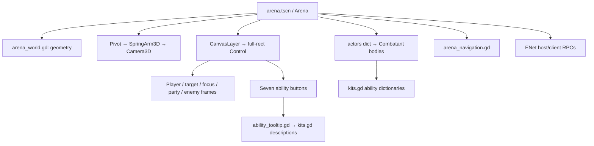

# Technical Architecture

_Reference for developers and AI agents making code changes. If a value here diverges from the code, **the code is authoritative** — update this file to match._

Design values (GCD, DR factors, healing formula, controls speeds) live in [`GAME_DESIGN.md`](GAME_DESIGN.md). This file covers implementation.

## Workspace and tools

| Item | Value |
| --- | --- |
| Repository | `/home/plato/codex` |
| Engine | Godot `4.5.1.stable.official.f62fdbde1` |
| Executable | `/usr/local/bin/godot` |
| Language | GDScript; Python stdlib for network test launchers |
| Main project | `project.godot` |
| Main scene | `arena.tscn` |
| Root node | `Arena` (`Node3D`) with `scripts/arena.gd` attached |
| Renderer | OpenGL compatibility (`gl_compatibility`) |
| Reference viewport | 1280 × 800; canvas-items stretch |
| Networking | ENet. Queues on UDP 27840 (duel) / 27841 (3v3); private lobby pool on 27850–27853. Ports live in `scripts/config.gd`. |
| Screenshots | `artifacts/` (with `.gdignore` so Godot skips them) |

## File map

Recommended reading order for a new developer: `kits.gd` → `combatant.gd` → `arena.gd` lifecycle and input → combat → network → UI → navigation → relevant tests.

| File | Responsibility |
| --- | --- |
| `project.godot` | Engine configuration, entry scene |
| `arena.tscn` | Minimal root scene; most content built at runtime |
| `scripts/arena.gd` | Match lifecycle, local input, camera, GUI, target selection, authoritative combat, bots, networking, dedicated mode. **~1,300 lines — flagged for extraction in [`ROADMAP.md`](ROADMAP.md).** |
| `scripts/arena_world.gd` | Floor, grid, pillars, walls, lighting. Parent of `arena.gd`. |
| `scripts/combatant.gd` | `CharacterBody3D` fighter — state, generated appearance, snapshot pack/apply. |
| `scripts/champion_model.gd` | Original faceted meshes and visual-only procedural joints for all three champions. Collision stays on the parent fighter. |
| `scripts/ability_art.gd` | Cached name-to-texture presentation mapping for 20 icons; hotbar art layer and engine-rendered frames. |
| `tools/art_review.gd` | Renders front/back character lineup and full icon atlas to `artifacts/` in a game window. |
| `scripts/kits.gd` | Champion names, ability dictionaries, short + expanded descriptions. |
| `scripts/ability_tooltip.gd` | Passive tooltip panel — wrapping text, cached content, viewport placement. |
| `scripts/arena_navigation.gd` | Inflated-obstacle AStarGrid2D pathfinding. |
| `scripts/config.gd` | Deploy-time constants — `SERVER_ADDRESS`, `SERVER_PORT`, `VERSION`, defaults. Deploy pipeline rewrites this per release. |
| `tests/combat_test.gd` | Deterministic combat, navigation, snapshot checks. |
| `tests/ui_test.gd` | Real-window mouse/key routing, frame clicks, tooltip content and bounds. |
| `tests/network_peer.gd` + `run_network.py` | Two-process ENet duel. |
| `tests/six_peer.gd` + `run_six.py` | Host + 5 clients (3v3). |
| `tests/dedicated_client.gd` + `run_dedicated.py` | Dedicated server + 2 clients (version handshake, auto-start). |
| `tests/visual_check.gd` | Staged lobby/healer screenshots. |

## Runtime structure



### Match state fields

- `actors` — actor ID → `Combatant` node. Round-local IDs, distinct from network peer IDs.
- `local_id` — actor controlled by this instance. Derived from `owner_peer`. **Not assumed** equal to peer ID. `-1` in dedicated mode.
- `selected_id`, `focus_id` — local UI target and focus. **Never** overwritten from network snapshots.
- `phase` — `menu` | `connecting` | `lobby` | `countdown` | `match` | `results`.
- `mode` — players **per team** (1 or 3). Not total players.
- `roster` — peer ID → `{champion, team}` for humans. Bots are not roster entries. Host is not a roster entry in dedicated mode.
- `network` — whether an ENet session is active. Offline uses `OfflineMultiplayerPeer`.
- `epoch` — round/session generation. Old messages must not affect a later round.
- `winner` — winning team index, or `-1` before results.
- `elapsed` — match time excluding countdown.
- `countdown` — starts at 3 s.
- `dedicated`, `min_players`, `rematch_delay` — dedicated-server config.
- `menu_state` — `main` | `online` | `offline`. Only meaningful when `phase == "menu"`.

### Fighter fields (per `Combatant`)

HP (max 100), seven cooldowns, GCD, cast slot / time / target, stun / lockout / ward / sprint timers, DR count / reset, movement intent, queued jump, input age, selected target, bot timers / path, peer / team / champion, network sequence bookkeeping.

`owner_peer == 0` → bot. Nonzero → human connection.

Dead fighters stay in the world (not removed) — capsule flattens and darkens, frames show 0 HP. Collision mask permits actor overlap; dead fighters do not body-block.

### Lifecycle

- `begin_round()` — clear actors, advance epoch, spawn humans from roster first, fill remaining slots with bots, set countdown, assign local, announce initial state via `round_started` RPC.
- `assign_local()` — finds the actor whose `owner_peer` matches this instance's peer ID; runs `cycle_target()` for an initial enemy. Automatic setup, not model picking.
- Countdown: actors settle to floor. Match: authority ticks each fighter, then checks whole-team elimination.
- 3v3 does not end on a single death — teammates continue.
- `finish_round()` — sets results, cancels casts, restores cursor, shows persistent victory / defeat. Clients apply the reliable final state. Periodic snapshots ignored after results.
- Opening the panel does **not** pause simulation — just zeroes local movement input.

## Combat pipeline

1. Local hotkey / button → `send_action(slot)`.
2. Offline or host → `try_spell(local_id, slot, selected_id)`. Client → RPC to host.
3. Host validates: sender ID → phase / epoch / sequence / rate → slot bounds → HP / stun / casting → cooldown / GCD → spell lockout.
4. `spell_target()` resolves helpful / self targeting.
5. `validate_spell()` checks living target, faction, distance, world-only line of sight, offensive facing.
6. Cast-time spell → stores `casting`, `cast_left`, `cast_target`. Instant → resolves immediately.
7. GCD starts when accepted (including cast start), unless `off`.
8. `tick_actor()` moves character, cancels casts on movement / airborne, decrements cast time, revalidates stored target on completion.
9. `resolve_spell()` starts own cooldown and applies the effect. `combat_event()` broadcasts visible feedback.
10. Authority checks team victory after ticking all actors.

**Rules:**

- Changed UI selection does not redirect an already-started cast.
- Invalid spells do not start GCD or cooldown.
- Otherwise-valid-but-ineffective interrupt / dispel / immune stun still spends its cooldown.
- Cancelled cast-time abilities keep the GCD already triggered but do not start their own cooldown.

Design values (GCD duration, DR factors, healing formula, etc.) live in [`GAME_DESIGN.md`](GAME_DESIGN.md).

## Networking

### Authority and transport

`authoritative()` is `true` offline or on the host. Only authority advances combat, physics, bot decisions, and results. Clients render server state and collect input.

ENet is created by `host_session()` (server) or `connect_to(port)` (client). `SceneMultiplayer.server_relay` is **disabled** — clients talk only to the host. Do not casually re-enable; see [`DECISIONS.md`](DECISIONS.md).

`current_port` is a variable, not a constant: the client sets it per connection, and a dedicated server takes it from `--port=` (falling back to the mode's queue port, or the first lobby port under `--lobby`).

### Client entry points

| Menu action | Function | Behavior |
| --- | --- | --- |
| Online queue | `matchmake()` | Connects to `Config.DUEL_PORT` or `TEAM_PORT` from the selected mode. Sets `searching`, so the lobby panel reads "Searching for…" with an `n of m players ready` count. |
| Host lobby | `host_lobby()` → `begin_probe("host", …)` | Walks `Config.LOBBY_PORTS` in order, sending `claim_lobby(mode, version)`. |
| Join lobby | `join_lobby(code)` → `begin_probe("join", …)` | Decodes the slot from the code's first character and dials that one server. Falls back to walking the pool if the prefix names no live slot. |

**Lobby codes encode their slot.** The first character is the index into `Config.LOBBY_PORTS` of the server that issued the code; the remaining characters are random. Pool members mint codes with no coordination, so without this two slots could issue the same string — and a joiner, which stops at the first match, would silently send players to the wrong lobby. Encoding the slot makes that collision impossible rather than merely unlikely, and lets a join skip the probe entirely. `Config.LOBBY_PORTS` must never grow past `CODE_ALPHABET`.

`intent` (`""` / `"queue"` / `"host"` / `"join"`) selects what `on_connected()` sends. The probe advances on three signals: an explicit `lobby_busy` reply, `connection_failed`, or the 10-second connect timeout. Exhausting the pool reports "All lobbies are in use" or "No lobby found with code X" and drops back to the menu.

`close_peer()` tears down the ENet peer **without** resetting menu state — that is the difference between it and `leave_session()`, and it is why probing can hop ports without bouncing the player to the main menu.

### Private lobbies

A lobby process runs `--dedicated --lobby --port=N` and idles with `private_lobby = true`, `claimed = false`. `claim_lobby` accepts only when unclaimed with an empty roster, then sets `mode`, `min_players = mode * 2`, generates a code, and replies `lobby_found(code, mode)`. `resolve_lobby` replies `lobby_found` only for an exact code match on a claimed, non-full lobby; every other case replies `lobby_busy` so the client keeps walking. The slot releases in `on_peer_left()` when the roster empties, logging `LOBBY RELEASED`.

`max_peers` for a private lobby is 6 regardless of mode — the mode is not known until a client claims it.

**Players never see an address or port.** `broadcast_lobby()` sends `""` in place of `status` to dedicated clients, because the server's status line names its port. The client composes its own lobby text from `roster`, `remote_min_players`, `searching` and `lobby_code`.

`max_peers`:

- Player-hosted (`--host`): 5 (host takes one slot).
- Dedicated (`--dedicated`): `mode * 2` (host takes no slot).

**Node path and RPC declarations must match between builds.** Test drivers instantiate `arena.tscn` under `/root/Arena`, matching regular play. Adding an RPC on only one side, or moving the root, breaks Godot's checksum matching.

### Core RPCs

| Method | Direction / permission | Delivery | Purpose |
| --- | --- | --- | --- |
| `register_player(choice, client_version)` | Client → host, any_peer | Reliable | Validate champion **and** `VERSION`; hard-reject mismatched versions |
| `rejected(reason)` | Host → client, authority | Reliable | Explain unavailable/full lobby or version mismatch |
| `lobby_state(players, size_per_team, message)` | Host → clients | Reliable | Roster, mode, status |
| `round_started(epoch, mode, states)` | Host → clients | Reliable | Complete initial actor setup |
| `submit_input(...)` | Client → host, any_peer | Unreliable ordered, ch 1 | Movement, yaw, jump, target |
| `submit_action(...)` | Client → host, any_peer | Reliable, ch 1 | Ability slot; `-1` cancels cast |
| `receive_snapshot(...)` | Host → clients | Unreliable ordered, ch 2 | DEFLATE-compressed fighter state |
| `ping_host` / `pong` | Client ↔ host | Unreliable, ch 3 | Displayed transport RTT |
| `private_notice(...)` | Host → owning client | Reliable | Rejection / cast feedback |
| `show_event(...)` | Host → clients | Reliable | Damage / heal / interrupt visuals |
| `finish_round(epoch, winner, states)` | Host → clients | Reliable | Final snapshot and winning team |

### Input and snapshots

- Host-owned input applied every physics tick.
- Remote input at 30 Hz; snapshots at 20 Hz.
- Input older than 0.3 s zeros intent — prevents endless movement if a client stops sending.
- Jump is a one-packet bool on the unreliable stream (loss can miss a jump; not hardened).
- Snapshots: `var_to_bytes()` + `FileAccess.COMPRESSION_DEFLATE`, decoded with matching dynamic decompression capped at 65536 bytes. **Do not switch to FASTLZ** — see [`DECISIONS.md`](DECISIONS.md).
- Clients ignore mismatched epoch, older-or-equal sequence, and periodic snapshots after results.
- Client bodies interpolate `net_position` / `net_yaw` with `delta * 22` capped at 1. **No prediction, no reconciliation, no lag compensation.** See [`ROADMAP.md`](ROADMAP.md).

### Client validation (server-side)

Remote input / action handlers obtain `multiplayer.get_remote_sender_id()` and resolve that peer's actor. They **do not trust** a client-supplied actor ID. Non-finite movement / yaw are rejected. Movement is capped to unit length. Desired yaw is wrapped to `[-π, π]`. Remote action attempts have a 0.05 s budget. Abilities still enforce their own cooldowns / GCD. **No packet flood defense or authentication exists.**

### Dedicated mode specifics

- `--dedicated` in `parse_arguments()` triggers `host_session(true)`.
- Host is not in `roster`; no actor has `owner_peer == 1`; `local_id` stays `-1`. Guards throughout the code already handle `not actors.has(local_id)`.
- After each `register_player` accept, `maybe_auto_start()` fires. When `roster.size() >= min_players` and `phase == "lobby"`, `begin_round()` runs.
- `finish_round()` on authority in dedicated mode schedules `get_tree().create_timer(rematch_delay).timeout.connect(_dedicated_rematch)`. The callback checks `phase == "results"` and roster size to decide whether to rematch or hold in lobby.
- Startup logs `DEDICATED READY <version> port=<n> mode=<n> min_players=<n> rematch_delay=<s> private=<bool>`. Round transitions log `DEDICATED ROUND START|END|REMATCH|WAITING`; private lobbies also log `LOBBY CLAIMED code=<c> port=<n> mode=<n>` and `LOBBY RELEASED port=<n>`. These lines are what `tests/run_dedicated.py` and `tests/run_lobby.py` grep for.

### Delay testing and disconnects

- `--latency-ms=N` (0–500) delays outgoing client input and outgoing host snapshots by N ms. Not jitter, not loss. Displayed RTT excludes injected delay.
- Client leaves during a match → its fighter's `owner_peer` becomes 0 (bot takes over). In-round disconnect notice is deferred rather than broadcast synchronously inside peer-disconnection processing.
- Host leaves → clients return to menu. No host migration.
- Rejected joins get an explanation and return to menu. Connection failure and ~10 s timeout also return to menu.

## Bots and navigation

Arena floor is 36 × 36 with boundary walls at ±18. Four pillars centered at x = ±6, z = ±5. Pillar shafts 2.8 × 5 × 2.8; bases / caps extend to 3.3 m. Physics geometry uses collision layer 1. Fighter capsules use layer 2, mask 1 (collide with world, not each other). Keep camera / LOS mask 1 independent of any targeting changes.

`arena_navigation.gd` builds a 35 × 35 one-meter AStar grid over integer coordinates `[-17, 17]`. Cells within two units in X and Z of pillar centers are solid, providing body clearance. Diagonals allowed only without corner obstacles. `nearest()` searches nearby free cells if an actor's rounded cell is solid; `route()` returns world-XZ waypoints.

**If arena geometry changes, update the grid too.** No automatic navmesh bake.

### Current bot behavior

- Sort enemies by distance, allies by HP.
- Luminary prioritizes an injured ally < 76 HP; others pursue nearest enemy.
- Vanguard melee range 2.8; others ranged desired distance 20.
- Replan paths every 0.45 s; consume waypoints within 0.55 m.
- Ability decisions every 0.25 s (fixed cadence).
- Ward below 45 HP; healer dispels controlled allies and heals damaged allies.
- Damage champs try interrupts when enemy cast remaining < 1 s.
- Vanguard charges from beyond 7 m; Ember tries to blink away from enemies closer than 5 m.
- Damage champs may self-heal below 55 HP with sight broken.

All bot casts go through `try_spell()` — same validation as players. Bots do not bypass range, cooldowns, or stun. Limitations recorded in [`ROADMAP.md`](ROADMAP.md).

## Rendering and UI

Feedback cues:

- Damaged / healed actors flash white briefly.
- Floating event labels rise / fade for ~1.1 s.
- Beam effects persist ~0.16 s.
- Overhead labels use billboard text; health meshes face the camera while avoiding a collinear look-at warning.

**Unit frame children are indexed** (see `update_frame()`):

0. Title Label
1. Health ProgressBar (with centered amount Label)
2. Cast ProgressBar (with centered cast Label)
3. Status Label

Changing this structure requires updating `update_frame()` and tests. Frame's `actor_id` metadata is refreshed each visual tick for click selection. Party / enemy rows are Buttons with live HP / status text, not separate scene instances.

**Anchor gotcha:** anchored controls must use `offset_left/top/right/bottom`. An earlier build used absolute `.position` after center/bottom anchor presets and placed the panel / hotbar off-screen. Real viewport screenshot checks caught it. Preserve corrected anchor offsets when editing menus / hotbar / tooltips / enemy frames.

**Tooltip initialization:** autowrapped Label text at an uninitialized width can temporarily calculate a very tall minimum size. The tooltip sets Label width before assigning new text and resetting its panel size. Tests wait for container layout before final screenshot/bounds assertions.

**Menu states** (`menu_state` variable, only meaningful when `phase == "menu"`):

- `"main"` — Online / Offline buttons.
- `"offline"` — Local sparring + Back.
- `"online"` — Host + address + Join + Back.

Rows are `HBoxContainer`s toggled by `refresh_menu()`. Mode picker is visible in submenus, hidden in main. Champion picker is always visible in the menu.

## HUD cooldowns

`scripts/cooldown_overlay.gd` is a `Control` parented to each hotbar button, drawing a radial sweep with `draw_colored_polygon` over a fan of points. Radius is half the slot's diagonal so the wedge reaches the corners rather than leaving lit crescents.

**It runs its own clock.** `update_visuals()` only refreshes when server state arrives, well below frame rate, so an overlay that waited to be told would tick in visible steps. `sync()` supplies the authoritative remaining/duration whenever a snapshot lands and `_process` fills the gaps.

`GCD_DURATION` in `arena.gd` is shared by the simulation and the sweep — the first of the duplicated balance constants noted in [`ROADMAP.md`](ROADMAP.md) to be pulled out of an inline literal.

Slot text is the ability name; the keybind is drawn in the overlay's corner so the countdown owns the centre. Once real icons exist the overlay needs no change — only what sits under it.

## Testing

All tests run from project root. Network suites bind fixed ports — **run sequentially**.

**Run `godot --headless --path . --import` first on any fresh clone.** Test
scripts launched with `--script` do not import assets themselves; without the
cache they fail to open every `.ctex` and the harnesses fail on the resulting
`ERROR:` lines even though every assertion passes. This only started mattering
when the project gained its first real assets — the ability icons.

```sh
# Build the import cache (fresh clone, or after changing an asset):
godot --headless --path . --import

# Import / parse check:
godot --headless --path . --editor --quit

# Combat (offline, headless-safe):
godot --headless --path . --script tests/combat_test.gd

# Real window required — mouse capture / cursor position don't work headless:
godot --path . --script tests/ui_test.gd

# Networked, sequential:
python3 tests/run_network.py
python3 tests/run_network.py --test-latency
python3 tests/run_network.py --test-team
python3 tests/run_network.py --test-team --test-latency
python3 tests/run_six.py
python3 tests/run_dedicated.py
python3 tests/run_lobby.py

# Lobby / healer screenshots:
godot --path . --script tests/visual_check.gd
```

`tests/check_suite.sh "<label>" <godot args...>` wraps a Godot suite for CI: it enforces the suite's exit code, requires the `N passed / M total` line to appear at all, and compares N against M. It deliberately does **not** compare against a literal count — a hardcoded number turns every new assertion into a CI failure, which is exactly what happened when the UI suite grew from 64 checks to 73 and the workflow was still grepping for 64.

Python launchers enforce timeouts and clean up child processes. They return failure on nonzero exits or Godot `ERROR:` output. Some success-marker text can appear even when assertions fail — inspect exit code and full output.

The `ERROR:` check is stricter than it looks: Godot prints RID-leak errors at exit for any `Control` that was constructed but never added to the scene tree, so an orphaned node fails the suite even when every assertion passed. If a network suite starts failing with `RID allocations ... were leaked at exit` and no assertion message, look for a `.new()` UI node missing its `add_child`.

### What each test verifies

- `combat_test.gd` — valid target/facing/LOS, movement cancellation, cast completion, GCD, off-GCD interrupt, spell lockout, own cooldown, DR progression/reset, ward mitigation, capped healing, Blink collision sweep, Charge range/damage, six-actor bot filling, one healer per local team, friendly heal/dispel, friendly-fire rejection, self fallback, heal LOS, individual vs team death, victory/defeat/rematch, real bot navigation, invalid input rejection, HP UI, compressed snapshot decoding, terminal-state protection.
- `run_network.py` — movement, damage, cast state, snapshots, rematch, disconnect takeover.
- `--test-team` — same but 3v3, both peers control humans, remaining slots are bots.
- `--test-latency` — 75 ms each direction (~150 ms total). Verifies no protocol warnings under delay.
- `run_six.py` — host + 5 clients, full 3v3 human roster. Balanced teams, all peers moving, shared team result.
- `run_dedicated.py` — one `--dedicated` server + 2 clients driven through `matchmake()`. Verifies version handshake, the queue's port-per-mode choice, and auto-start via server output.
- `run_lobby.py` — two `--lobby` servers + 3 clients. The first host claims 27850 and holds it; the second must probe past it to 27851. Verifies `lobby_busy` probe advance, that each code decodes to the slot that issued it, and that a code-joined duel starts. Both clients print `LOBBY CODE=<code> port=<n>` so a failure says which server answered.

### UI test coverage

- Click self / enemy models without retargeting.
- Repeated both-mouse-button capture cycles preserve target and restore cursor position.
- Player / party / enemy / focus frame clicks.
- Tab and F1 key targeting.
- Hover and stationary Shift expand/collapse.
- Tooltip hidden during panel / capture; doesn't steal button / frame clicks.
- All 21 expanded champion-slot descriptions fit the 1280 × 800 reference viewport.

The UI test **rejects `--headless`** — cursor APIs are not faithfully emulated by the dummy display driver.

## Troubleshooting

| Symptom | First checks |
| --- | --- |
| "Server isn't up" / queue hangs | Is the instance for that mode running (`systemctl status 'starfall@*'`)? Is its UDP port reachable? Locally, use `--join=127.0.0.1` or drive `matchmake()` as the tests do. |
| "No lobby found with code X" | The code is right but every pool port was walked without a match. Either the holding instance is down, or `Config.LOBBY_PORTS` and the services in `docker-compose.yml` have drifted out of step. |
| "All lobbies are in use" | Every slot in `Config.LOBBY_PORTS` is claimed. Slots release when their last player disconnects; a crashed client holds one until ENet times out. |
| Host starts but nothing fights | Non-dedicated host must click Start (3 s countdown follows). Plain headless `--host` has no way to click Start; use `--dedicated`. |
| "Could not bind port" | Another instance owns that port. With six server processes, check which: `ss -ulnp | grep 278`. Identify before killing. |
| Cast won't start | Phase, living target/team, range, sight, facing, movement/ground, GCD/CD, existing cast, stun/lockout. |
| Healing self instead of teammate | Helpful spells with no ally selected fall back to self. Use F2/F3 or party frame. |
| Dispel doesn't remove lockout | Dispel only removes stun. Design decision. |
| Blink stops early | Capsule sweep hit geometry — intentional. |
| Clicking a model does nothing | Intentional. Use Tab / frames / keybinds. See [`DECISIONS.md`](DECISIONS.md). |
| Tooltip fails only in headless | Cursor APIs aren't emulated headless. Run real-window UI test. |
| Tooltip blank / tall initially | Label width must be set before text, then reset panel min size. |
| Hotbar / panel off-screen | Check anchor offsets, not absolute `.position` after preset. |
| FASTLZ decompression errors | Snapshots use DEFLATE with dynamic decompression. Don't mix. See [`DECISIONS.md`](DECISIONS.md). |
| ENet oversized unreliable packet | Compressed payload exceeds MTU. Don't remove compression. |
| Errors when many peers quit | Preserve `server_relay = false` and deferred in-match disconnect announcements. |
| RPC checksum / path errors | Both sides need same scripts, RPC declarations, `/root/Arena` root path. |
| Version mismatch on join | Client and server disagree on `Config.VERSION`. Rebuild both from the same commit. |
| Game reads old code | Stop and relaunch after edits. New script files may need editor import. |
